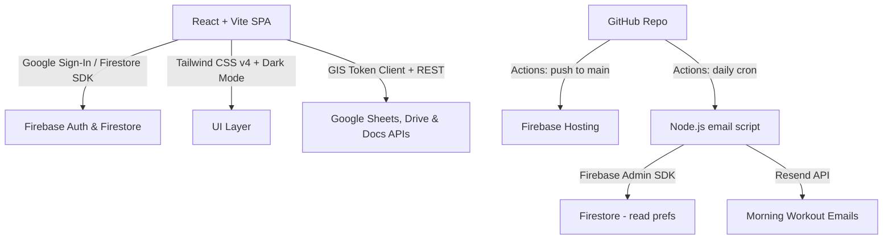

# Hevy-Inspired Personal Training Platform ("Consultoria") — Design Doc

This document outlines the architecture, database schema, integration flows, and implementation plan for **Consultoria**, a mobile-first web app that replaces manual Google Sheets tracking with a premium interactive experience for personal trainers and their students.

---

## 🎯 Project Goals

- **Premium Aesthetics**: Responsive dark-mode UI with glassmorphism, micro-animations, and optimized mobile/tablet layouts.
- **Near-Zero Cost**: Scale for 1 trainer and up to 20 students, staying within free quotas on Firebase Blaze and Resend. Expected monthly bill: **$0.00–$0.05**.
- **Google Workspace as Source of Truth**: All workout data, exercise libraries, feedback docs, and progress photo folders live in the trainer's and students' Google Drive/Sheets. Firestore stores metadata, session state, and report caches only.
- **Language-Synced Google Artifacts**: All Google Drive folders, Spreadsheet tabs/columns, Docs, and the Exercise Library are created in the **trainer's** selected language. The student's language setting controls only the app UI.
- **Secure Secrets**: No secrets committed to the public GitHub repo. GitHub Secrets + Firebase environment variables cover all cases.
- **Brand Customization**: Trainers can upload a logo that is embedded into every generated weekly spreadsheet.

---

## 🛠️ Tech Stack



### Frontend
- **React 19 + Vite** — SPA, fast HMR, optimized production bundles.
- **TypeScript** — strict mode throughout.
- **Tailwind CSS v4** — responsive utilities, native dark mode via `class` strategy.
- **Recharts** — workout progression graphs.
- **Lucide React** — icon set.
- **canvas-confetti** — post-workout celebration animation.

### Backend & Auth
- **Firebase Auth** — Google Sign-In, manages OAuth session.
- **Google Identity Services (GIS) Token Client** — client-side OAuth access token management with silent refresh (see §OAuth Token Strategy).
- **Cloud Firestore** — user profiles, workspace config, session metadata, workout log cache for reports. **Blaze plan** (pay-as-you-go, free quota covers this project entirely).
- **Firebase Hosting** — CDN-backed static hosting with free SSL.

### Integrations
- **Google Sheets API** — read Config tab to render workouts; write student actuals back to session tabs; create and populate the Exercise Library sheet on trainer registration.
- **Google Drive API** — create and manage folder structures; list progress photo folders.
- **Google Docs API** — create per-session feedback documents inside the trainer's feedback folder.
- **Resend** — transactional email (morning workout emails + session notifications). Free tier: 3,000 emails/month.

### CI/CD
- **GitHub Actions** — build and deploy on push to `main`; daily cron for morning emails.

---

## 🔑 Google OAuth Token Strategy (Zero-Cost, Client-Side)

Firebase Auth's `signInWithPopup` returns a one-time Google access token that expires after **1 hour**. Rather than routing Google API calls through a server to manage refresh tokens (which would require active Cloud Functions), we use the **Google Identity Services Token Client** for silent client-side refresh.

### Flow

1. On app load, initialise a GIS Token Client once:
   ```ts
   const tokenClient = google.accounts.oauth2.initTokenClient({
     client_id: VITE_GOOGLE_CLIENT_ID,
     scope: [
       'https://www.googleapis.com/auth/spreadsheets',
       'https://www.googleapis.com/auth/drive.file',
       'https://www.googleapis.com/auth/documents',
     ].join(' '),
     callback: (resp) => {
       storeToken(resp.access_token, Date.now() + resp.expires_in * 1000);
     },
   });
   ```
2. Store `{ accessToken, expiresAt }` in React context (memory only — never localStorage).
3. Before every Google API call, call `getValidToken()`:
   ```ts
   async function getValidToken(): Promise<string> {
     if (Date.now() < expiresAt - 5 * 60 * 1000) return accessToken; // 5-min buffer
     return new Promise((resolve) => {
       tokenClient.requestAccessToken({ prompt: '' }); // silent if Google session active
       // callback above resolves on next tick
     });
   }
   ```
4. `prompt: ''` means no popup is shown as long as the user's Google session is alive in the browser (the common case). A popup only appears if the session has genuinely expired, which is rare during an active workout.

---

## 📊 Database Models (Firestore)

### `users` Collection
```ts
interface User {
  uid: string;
  email: string;
  displayName: string;
  photoURL: string;
  role: 'trainer' | 'student';
  selectedLanguage: 'en' | 'pt-BR';
  createdAt: Timestamp;
}
```
> Trainer logo is stored on the `workspaces` document, not `users`, so it is workspace-scoped.

---

### `workspaces` Collection
```ts
interface Workspace {
  id: string;                        // trainer's email (stable, human-readable)
  trainerUid: string;
  trainerEmail: string;
  trainerName: string;
  language: 'en' | 'pt-BR';         // drives ALL Google artifact naming
  logoURL?: string;                  // trainer logo in Google Drive or Firebase Storage
  exerciseLibrarySheetId?: string;   // Sheet ID created on registration
  exerciseLibraryCreatedAt?: Timestamp;
  rootDriveFolderId?: string;        // "Consultoria Training" / "Treinos Consultoria"
  feedbackFolderId?: string;         // "Feedbacks" sub-folder
  createdAt: Timestamp;
}
```

---

### `student_workspaces` Collection
```ts
interface StudentWorkspace {
  id: string;                       // `${studentUid}_${workspaceId}`
  studentUid: string;
  studentEmail: string;
  workspaceId: string;
  status: 'pending' | 'active' | 'read-only';
  // 'pending'   → trainer invited, student has not yet signed in / accepted
  // 'active'    → student is a full member
  // 'read-only' → trainer removed student; history visible, no new logs allowed
  joinedAt?: Timestamp;             // set when status transitions pending → active
  emailPreferences: {
    morningEmailEnabled: boolean;
    // Maps session name (e.g. "Session A") to day-of-week (0=Sun … 6=Sat)
    sessionDays: Record<string, number>;
  };
}
```

---

### `training_cycles` Collection
```ts
interface TrainingCycle {
  id: string;
  workspaceId: string;
  studentUid: string;               // one cycle per student
  name: string;                     // e.g. "Cycle 1 – Hypertrophy"
  startDate: Timestamp;
  endDate: Timestamp;
  isActive: boolean;
  totalWeeks: number;
}
```

---

### `weekly_sheets` Collection
```ts
interface WeeklySheet {
  id: string;
  cycleId: string;
  workspaceId: string;
  studentUid: string;
  weekNumber: number;               // 1-based within the cycle
  weekStartDate: Timestamp;         // Monday of that week
  googleSheetId: string;
  googleSheetUrl: string;
  sessions: SessionDefinition[];    // ordered list of sessions in this sheet
  createdAt: Timestamp;
}

interface SessionDefinition {
  tabName: string;                  // e.g. "Session A" / "Treino A"
  sessionKey: string;               // stable key used in emailPreferences: "A", "B", etc.
}
```

---

### `workout_logs` Collection
```ts
interface WorkoutLog {
  id: string;                       // `${studentUid}_${weeklySheetId}_${sessionKey}`
  studentUid: string;
  workspaceId: string;
  cycleId: string;
  weeklySheetId: string;
  sessionKey: string;               // "A", "B", etc.
  sessionTabName: string;
  googleSheetId: string;
  status: 'in_progress' | 'completed';
  startedAt: Timestamp;
  finishedAt?: Timestamp;
  preWorkout: {
    energyLevel: 1 | 2 | 3 | 4 | 5;
    feeling: 'well' | 'not-well';
  };
  postWorkout?: {
    feeling: 'same' | 'better' | 'worse';
  };
  // Cached exercise data — written on session finish for fast report queries.
  // Source of truth is always the Google Sheet; this is a read cache only.
  exerciseCache: WorkoutExerciseCache[];
}

interface WorkoutExerciseCache {
  exerciseName: string;
  setIndex: number;                 // 0-based
  plannedReps: number;
  plannedLoad: number;
  plannedRpe: number;
  actualReps?: number;
  actualLoad?: number;
  actualRpe?: number;
  wasCustomized: boolean;
  isDone: boolean;
  observations?: string;
}
```

---

### `feedback` Collection
```ts
interface Feedback {
  id: string;                       // `${workspaceId}_${workoutLogId}`
  workoutLogId: string;
  studentUid: string;
  workspaceId: string;
  trainerUid: string;
  googleDocId: string;
  googleDocUrl: string;
  createdAt: Timestamp;
  updatedAt: Timestamp;
}
```

---

### `admins` Collection
```ts
// Document ID = admin user's UID
interface AdminRecord {
  uid: string;
  email: string;        // denormalised for console readability
  grantedAt: Timestamp;
  grantedBy: string;    // email of the person who granted admin (audit trail)
}
```

> **Admin records are created exclusively through the Firebase Console or a one-time bootstrap script — never through the app UI.** This ensures no privilege-escalation path exists in the client code. A user's `role` in the `users` collection (`'trainer'` or `'student'`) is unaffected by admin status.

---

## 🔐 Admin Mode

### Purpose

Admin mode allows designated super-users to impersonate any trainer or student and view the full UI experience as that user. This is the primary tool for investigating bugs reported by users without needing to share credentials or reproduce issues blind.

### How Admins Are Granted

1. An admin is created by adding a document to the `admins` Firestore collection with the target user's UID as the document ID.
2. This is done manually via the Firebase Console or a one-time bootstrap script — **never through the app UI**.
3. Any Google-authenticated user can be an admin, regardless of whether their `users` doc has `role: 'trainer'` or `role: 'student'`. The admin permission is orthogonal to role.

### Admin Panel (`/admin`)

Accessible only when `admins/{uid}` exists for the current user. The panel shows:

- **User search / list**: all users from the `users` collection, filterable by name, email, or role.
- **"View as" button**: next to each user, opens that user's dashboard experience.

### Impersonation ("View As") Model

Because Firebase Auth cannot be swapped client-side without a full re-login, impersonation is a **UI-layer overlay**, not a real auth swap:

1. Admin clicks "View as" on a user.
2. The app stores `{ impersonatedProfile, impersonatedRole }` in a React context (`AdminImpersonationContext`).
3. `TrainerDashboard` and `StudentDashboard` read from `impersonatedProfile` instead of the real `AuthContext.profile` when impersonation is active.
4. All Firestore reads still go through the **admin's own auth token**, so Firestore security rules must grant admins read access to all collections (see §Firestore Security Rules).
5. Writes are **blocked** while impersonating — the admin is in observe-only mode. Any action that would mutate data shows a disabled state with a tooltip: *"Disabled in admin view"*.
6. A persistent **"Admin View" banner** is shown at the top of every page while impersonating:
   - Shows: avatar + name + role of the impersonated user.
   - "Exit Admin View" button returns to the admin panel.

### Security Constraints

- The `/admin` route is guarded by `AdminRoute` (similar to `ProtectedRoute`), which checks `admins/{uid}` existence on load.
- Admin status is checked once on mount and cached for the session — no polling.
- The `admins` collection is **not readable by non-admins** (enforced in Firestore rules), so a client-side check alone is not the only gate.
- No admin can write to any collection while impersonating (enforced in UI layer; Firestore rules additionally block writes using the admin's real UID in contexts where only the impersonated user's UID would be valid).

---

## 🗂️ Exercise Library — Initial Seeding

When a trainer creates their account, the app automatically creates a Google Sheet titled according to their language:

| Language | Sheet Title |
| :--- | :--- |
| English | `Exercise Library — Consultoria` |
| Portuguese | `Biblioteca de Exercícios — Consultoria` |

### Sheet Columns (also language-matched)

| EN | PT-BR |
| :--- | :--- |
| Name | Nome |
| Muscle Group | Grupo Muscular |
| Equipment | Equipamento |
| Description | Descrição |
| Video URL | URL do Vídeo |

### Pre-Seeded Exercises (77 total — CrossFit Essentials playlist, positions 1–81 excluding 56, 60, 74, 79)

The `Name` and `Video URL` columns are pre-populated. `Muscle Group`, `Equipment`, and `Description` are left blank for the trainer to complete at their convenience.

| # | Name | Video URL |
|---|---|---|
| 1 | Burpee | https://www.youtube.com/watch?v=auBLPXO8Fww |
| 2 | Power Snatch | https://www.youtube.com/watch?v=TL8SMp7RdXQ |
| 3 | Push Press | https://www.youtube.com/watch?v=iaBVSJm78ko |
| 4 | Thruster | https://www.youtube.com/watch?v=L219ltL15zk |
| 5 | Clean and Jerk | https://www.youtube.com/watch?v=PjY1rH4_MOA |
| 6 | Hang Power Clean | https://www.youtube.com/watch?v=0aP3tgKZcHQ |
| 7 | Front Squat | https://www.youtube.com/watch?v=uYumuL_G_V0 |
| 8 | Deadlift | https://www.youtube.com/watch?v=1ZXobu7JvvE |
| 9 | Clean | https://www.youtube.com/watch?v=Ty14ogq_Vok |
| 10 | Dumbbell Power Snatch | https://www.youtube.com/watch?v=3mlhF3dptAo |
| 11 | Shoulder Press | https://www.youtube.com/watch?v=5yWaNOvgFCM |
| 12 | Dumbbell Thruster | https://www.youtube.com/watch?v=u3wKkZjE8QM |
| 13 | Air Squat | https://www.youtube.com/watch?v=rMvwVtlqjTE |
| 14 | Hang Power Snatch | https://www.youtube.com/watch?v=-mLzQdVAwlw |
| 15 | Dumbbell Push Press | https://www.youtube.com/watch?v=4tCaD42ghlc |
| 16 | Dumbbell Turkish Get-Up | https://www.youtube.com/watch?v=saYKvqSscuY |
| 17 | Snatch | https://www.youtube.com/watch?v=GhxhiehJcQY |
| 18 | Wall Walk | https://www.youtube.com/watch?v=NK_OcHEm8yM |
| 19 | Kettlebell Swing | https://www.youtube.com/watch?v=mKDIuUbH94Q |
| 20 | Bench Press | https://www.youtube.com/watch?v=SCVCLChPQFY |
| 21 | Push-Up | https://www.youtube.com/watch?v=0pkjOk0EiAk |
| 22 | Strict Handstand Push-Up | https://www.youtube.com/watch?v=0wDEO6shVjc |
| 23 | Box Step-Up | https://www.youtube.com/watch?v=5qjqDHOUh-A |
| 24 | Back Squat | https://www.youtube.com/watch?v=QmZAiBqPvZw |
| 25 | Sumo Deadlift High Pull | https://www.youtube.com/watch?v=gh55vVlwlQg |
| 26 | Box Jump | https://www.youtube.com/watch?v=NBY9-kTuHEk |
| 27 | Muscle Snatch | https://www.youtube.com/watch?v=bJYzOo1cNqY |
| 28 | Kettlebell Snatch | https://www.youtube.com/watch?v=Pm-b2XFeABA |
| 29 | Kipping Toes-to-Bar | https://www.youtube.com/watch?v=6dHvTlsMvNY |
| 30 | Burpee Box Jump Over | https://www.youtube.com/watch?v=GLktGkmcvWE |
| 31 | Split Jerk | https://www.youtube.com/watch?v=GUDkOtraHHY |
| 32 | Dumbbell Clean | https://www.youtube.com/watch?v=SYxObzJ3gn0 |
| 33 | Dumbbell Hang Clean | https://www.youtube.com/watch?v=8r44xv_Aqbw |
| 34 | Walking Lunge | https://www.youtube.com/watch?v=DlhojghkaQ0 |
| 35 | Dumbbell Power Clean | https://www.youtube.com/watch?v=viWI2rEt-HU |
| 36 | Strict Bar Muscle-Up | https://www.youtube.com/watch?v=o69WaY_7k2c |
| 37 | Medicine-Ball Clean | https://www.youtube.com/watch?v=KVGhkHSrDJo |
| 38 | Kipping Chest-to-Bar Pull-Up | https://www.youtube.com/watch?v=AyPTCEXTjOo |
| 39 | Inverted Burpee | https://www.youtube.com/watch?v=M6_nkTKhaFY |
| 40 | Slam Ball | https://www.youtube.com/watch?v=k9W6g9LvXDI |
| 41 | Strict Toes-to-Bar | https://www.youtube.com/watch?v=xX9Hzi7Onnw |
| 42 | Ring Dip | https://www.youtube.com/watch?v=EznLCDBAPIU |
| 43 | Pull-Over | https://www.youtube.com/watch?v=faJDYEZmueM |
| 44 | Rowing | https://www.youtube.com/watch?v=fxfhQMbATCw |
| 45 | Ring Row | https://www.youtube.com/watch?v=sEAOZc77wk8 |
| 46 | Dumbbell Overhead Squat | https://www.youtube.com/watch?v=azumEfnk-GI |
| 47 | Sots Press | https://www.youtube.com/watch?v=eJ9MLnNV6FY |
| 48 | AbMat Sit-Up | https://www.youtube.com/watch?v=VIZX2Ru9qU8 |
| 49 | Dumbbell Push Jerk | https://www.youtube.com/watch?v=rnN3pYswScE |
| 50 | Hang Power Clean and Push Jerk | https://www.youtube.com/watch?v=8IYt7AtP8BI |
| 51 | Zercher Squat | https://www.youtube.com/watch?v=nwx6Ip7hd3I |
| 52 | Hanging L-Sit | https://www.youtube.com/watch?v=WHi1bvZLwlw |
| 53 | Strict Muscle-Up | https://www.youtube.com/watch?v=vJTJFc2wmk4 |
| 54 | L Pull-Up | https://www.youtube.com/watch?v=qeGS55RHBUU |
| 55 | Chest-to-Wall Handstand Push-Up | https://www.youtube.com/watch?v=lkPPVyExFpU |
| 56 | Hang Clean and Push Jerk | https://www.youtube.com/watch?v=KBpys4KTG5Q |
| 57 | GHD Sit-Up | https://www.youtube.com/watch?v=oFwt7WfnPcc |
| 58 | Modified Rope Climb: Pull to Stand | https://www.youtube.com/watch?v=BsDRv1fiXIY |
| 59 | Strict Chest-to-Bar Pull-Up | https://www.youtube.com/watch?v=xf69XHAs5w8 |
| 60 | Handstand | https://www.youtube.com/watch?v=_-9_46by2JI |
| 61 | GHD Hip, Back, and Hip-Back Extensions | https://www.youtube.com/watch?v=uha4orxDqSM |
| 62 | Split Snatch | https://www.youtube.com/watch?v=VFdCGK8yk-8 |
| 63 | Shoot-Through | https://www.youtube.com/watch?v=sZ9fP4iOmFs |
| 64 | Medicine Ball Progression | https://www.youtube.com/watch?v=TlneBvU4XFY |
| 65 | Handstand Pirouettes | https://www.youtube.com/watch?v=tTnvKzRLCUk |
| 66 | Power Clean and Split Jerk | https://www.youtube.com/watch?v=Sk1vhXhHO_A |
| 67 | Split Clean | https://www.youtube.com/watch?v=a5CR3Bi2Gc8 |
| 68 | GHD Back Extension | https://www.youtube.com/watch?v=ivDB23Kcv-A |
| 69 | Strict Toes to Rings | https://www.youtube.com/watch?v=1zp-B1Vb_Vs |
| 70 | GHD Hip Extension | https://www.youtube.com/watch?v=P0iuN0xygc0 |
| 71 | GHD Hip & Back Extension | https://www.youtube.com/watch?v=QdCzafAXJhY |
| 72 | L-Sit Rope Climb | https://www.youtube.com/watch?v=Ewf8rqGRbrE |
| 73 | Freestanding Handstand Push-Up | https://www.youtube.com/watch?v=aAErmRDDJKY |
| 74 | Kipping Deficit Handstand Push-Up | https://www.youtube.com/watch?v=DJA1t6Fp5WE |
| 75 | Swing to Backward Roll to Support | https://www.youtube.com/watch?v=nwpEUd_Yc_E |
| 76 | L-Sit on Rings | https://www.youtube.com/watch?v=lwcHmXvw-T4 |
| 77 | Planche Press | https://www.youtube.com/watch?v=z8mC1DND2kI |

> Exercise names remain in English regardless of the trainer's language setting. The trainer is free to rename, add, or remove rows in the sheet at any time.

---

## 🔄 Language Localization Rules

### Rule: Trainer's Language Drives All Google Artifacts

The `workspaces.language` field determines the language of every Google-hosted artifact. The student's `selectedLanguage` controls **only their app UI** — it has no effect on spreadsheet column headers, tab names, folder names, or document titles.

### Localization Dictionary

| Entity | English | Portuguese (Brasil) |
| :--- | :--- | :--- |
| **Root Drive Folder** | `Consultoria Training` | `Treinos Consultoria` |
| **Feedback Sub-folder** | `Feedbacks` | `Feedbacks` |
| **Progress Photos Folder** | `Progress Photos — {StudentName}` | `Fotos de Evolução — {StudentName}` |
| **Weekly Sheet Title** | `{StudentName} — Week {N} — {CycleName}` | `{StudentName} — Semana {N} — {CycleName}` |
| **Config Tab** | `Config` | `Configuração` |
| **Session Tab** | `Session {X}` | `Treino {X}` |
| **Config Columns** | `Session, Group, Exercise, Sets, Reps, Load, RPE, Rest, Observations` | `Treino, Grupo, Exercício, Séries, Repetições, Carga, RPE, Descanso, Observações` |
| **Group Values** | `Warm-up, Training, Extra` | `Aquecimento, Treino, Extra` |
| **Exercise Library Sheet** | `Exercise Library — Consultoria` | `Biblioteca de Exercícios — Consultoria` |
| **Exercise Library Columns** | `Name, Muscle Group, Equipment, Description, Video URL` | `Nome, Grupo Muscular, Equipamento, Descrição, URL do Vídeo` |
| **Feedback Doc Title** | `Feedback — {StudentName} — {SessionTabName} — Week {N}` | `Feedback — {StudentName} — {SessionTabName} — Semana {N}` |

---

## 🏗️ Google Drive Folder Structure

All Google Drive artifacts are created in the **trainer's Google Drive** using their OAuth token.

```
Consultoria Training/                        ← root folder (created on trainer registration)
├── Feedbacks/                               ← created on trainer registration
│   ├── Feedback — Ana — Session A — Week 1.gdoc
│   └── Feedback — Ana — Session B — Week 1.gdoc
└── Progress Photos — Ana/                  ← created when student enables progress photos
    ├── 2025-01-15/                          ← created on demand; student uploads here directly
    └── 2025-02-01/
```

Weekly spreadsheets are created in the trainer's root Drive (not inside the folder above), to keep them easily accessible by students who are given viewer/editor access.

---

## 📋 Spreadsheet Structure (Per Weekly Sheet)

Each weekly sheet is created by the app via the Sheets API when the trainer generates a new week for a student.

```
[ Session A ]  [ Session B ]  …  [ Config ]
                                    ↑ last tab always
```

### Config Tab Layout

| Row 1 (frozen header) |
|---|
| Session \| Group \| Exercise \| Sets \| Reps \| Load \| RPE \| Rest \| Observations |

- Trainer fills this tab to define the week's workout plan.
- Each row is one set of one exercise within a session.
- The `Session` column value must match a session tab name exactly.
- Exercises in the `Exercise` column are validated against the Exercise Library sheet.

### Session Tab Layout

Populated automatically from the Config tab when the sheet is generated (or when the trainer finalises the Config tab). Each session tab has:

- **Header rows**: trainer logo (if set) + trainer name, week number, student name.
- **Exercise rows**: read-only planned values (Sets, Reps, Load, RPE, Rest, Observations from Config) + editable student columns: `Actual Reps`, `Actual Load`, `Actual RPE`, `Customized?` (checkbox), `Done?` (checkbox), `Student Notes`.
- **Sentinel rows**: `PRE_ENERGY`, `PRE_FEELING`, `POST_FEELING` — special rows the app writes to when the student starts/finishes a session.

---

## 👤 Student Invitation & Onboarding Flow

```
Trainer invites student email
        ↓
student_workspaces doc created  (status: 'pending')
        ↓
Student receives email with sign-in link
        ↓
Student signs in with Google (first time or returning)
        ↓
App detects pending student_workspaces for their email
        ↓
Student accepts → status: 'active', joinedAt: now()
        ↓
Student sees workspace in their dashboard
```

**Key rules**:
- A student with `status: 'pending'` cannot view any workout content yet.
- When a trainer removes a student, status transitions `active → read-only`. The student retains visibility of all historical `workout_logs` and weekly sheets but cannot start new sessions.
- A `read-only` student can still be invited by other trainers and join new workspaces.
- Deleting a student account removes all `student_workspaces` records but does **not** delete their Google Sheets data (those live in the trainer's Drive).

---

## 📧 Morning Email Engine (GitHub Actions Cron)

Rather than Firebase Cloud Functions (which require the Blaze plan's active invocation to run on a schedule), morning emails are sent by a **GitHub Actions scheduled workflow** running a Node.js script.

### How It Works

```
GitHub Actions cron (daily, 11:00 UTC / 8:00 AM ET)
        ↓
scripts/send-morning-emails.ts
  - Firebase Admin SDK → query Firestore for today's sessions
  - Sheets API → fetch that student's session tab for the day
  - Resend API → send personalised email
```

### Email Content

Each morning email contains:
- Greeting with student's name (in **student's** language — this is UI comms, not a Google artifact).
- The full workout grid for that session: Exercise, Group, Sets × Reps, Load, RPE, Rest, Observations.
- A deep link button: **"Open in Consultoria"** → routes directly to that session in the app.
- Footer: trainer name + logo (if set).

### GitHub Actions Workflow Snippet

```yaml
# .github/workflows/morning-emails.yml
name: Morning Workout Emails
on:
  schedule:
    - cron: '0 11 * * *'   # 11:00 UTC daily
  workflow_dispatch:         # manual trigger for testing
jobs:
  send-emails:
    runs-on: ubuntu-latest
    steps:
      - uses: actions/checkout@v4
      - uses: pnpm/action-setup@v3
        with: { version: 9 }
      - uses: actions/setup-node@v4
        with: { node-version: '20', cache: 'pnpm' }
      - run: pnpm install --frozen-lockfile
      - run: pnpm tsx scripts/send-morning-emails.ts
        env:
          FIREBASE_SERVICE_ACCOUNT_KEY: ${{ secrets.FIREBASE_SERVICE_ACCOUNT_KEY }}
          RESEND_API_KEY: ${{ secrets.RESEND_API_KEY }}
          GOOGLE_SERVICE_ACCOUNT_KEY: ${{ secrets.GOOGLE_SERVICE_ACCOUNT_KEY }}
```

---

## 📸 Progress Photos

Progress photos are **not uploaded through the app**. The workflow is:

1. Student (or trainer) taps **"Add Progress Photos"** in the app.
2. App calls the Drive API to create a dated subfolder under `Progress Photos — {StudentName}/` (e.g., `2025-01-15`). Access is shared with the student's Google account.
3. App displays a **"Open folder in Google Drive"** button that deep-links to that folder.
4. Student uploads photos directly in the Google Drive app/browser (familiar, no re-implementation needed).
5. In the app, the **Progress Photos** page uses the Drive API to list all dated subfolders, fetch thumbnail URLs for photos inside them, and display a timeline.
6. Student can select any two photos from the timeline for a **side-by-side comparison** view.

---

## 🔒 Secrets & Environment Management

| Secret | Where Stored | How Used |
| :--- | :--- | :--- |
| Firebase client config (`VITE_FIREBASE_*`) | `.env.local` (dev) / GitHub Secrets (CI) | Public-safe; Vite embeds at build time |
| `VITE_GOOGLE_CLIENT_ID` | `.env.local` / GitHub Secrets | Used by GIS Token Client in the browser |
| `RESEND_API_KEY` | GitHub Secrets | Used only in `send-morning-emails.ts` script |
| `FIREBASE_SERVICE_ACCOUNT_KEY` | GitHub Secrets | Used by Admin SDK in email script + CI deploy |
| `GOOGLE_SERVICE_ACCOUNT_KEY` | GitHub Secrets | Used by email script for Sheets read in cron |

> **Firebase client config is safe to commit** — it identifies your Firebase project but is protected by Firebase Security Rules and Google API key restrictions (HTTP referrer allowlist).

---

## 🚀 Build & Deploy (GitHub Actions)

```yaml
# .github/workflows/deploy.yml
name: Build and Deploy
on:
  push:
    branches: [main]
jobs:
  build_and_deploy:
    runs-on: ubuntu-latest
    steps:
      - uses: actions/checkout@v4
      - uses: pnpm/action-setup@v3
        with: { version: 9 }
      - uses: actions/setup-node@v4
        with: { node-version: '20', cache: 'pnpm' }
      - run: pnpm install --frozen-lockfile
      - run: pnpm run build
        env:
          VITE_FIREBASE_API_KEY: ${{ secrets.VITE_FIREBASE_API_KEY }}
          VITE_FIREBASE_AUTH_DOMAIN: ${{ secrets.VITE_FIREBASE_AUTH_DOMAIN }}
          VITE_FIREBASE_PROJECT_ID: ${{ secrets.VITE_FIREBASE_PROJECT_ID }}
          VITE_FIREBASE_STORAGE_BUCKET: ${{ secrets.VITE_FIREBASE_STORAGE_BUCKET }}
          VITE_FIREBASE_MESSAGING_SENDER_ID: ${{ secrets.VITE_FIREBASE_MESSAGING_SENDER_ID }}
          VITE_FIREBASE_APP_ID: ${{ secrets.VITE_FIREBASE_APP_ID }}
          VITE_GOOGLE_CLIENT_ID: ${{ secrets.VITE_GOOGLE_CLIENT_ID }}
      - uses: FirebaseExtended/action-hosting-deploy@v0
        with:
          repoToken: ${{ secrets.GITHUB_TOKEN }}
          firebaseServiceAccount: ${{ secrets.FIREBASE_SERVICE_ACCOUNT_KEY }}
          projectId: ${{ secrets.VITE_FIREBASE_PROJECT_ID }}
          channelId: live
```

---

## 🛡️ Firestore Security Rules (Sketch)

```js
rules_version = '2';
service cloud.firestore {
  match /databases/{database}/documents {

    // Users can only read/write their own profile; admins can read any profile
    match /users/{uid} {
      allow read: if request.auth.uid == uid || isAdmin();
      allow write: if request.auth.uid == uid;
    }

    // Admins collection: readable only by the owner (self-check on login) — NOT by other users
    match /admins/{uid} {
      allow read: if request.auth.uid == uid;
      allow write: if false;   // never writable from the client
    }

    // Workspace: readable by trainer + any associated student + admins; writable only by trainer
    match /workspaces/{workspaceId} {
      allow read: if request.auth != null &&
        (isAdmin() || isTrainerOf(workspaceId) || isStudentOf(workspaceId));
      allow write: if isTrainerOf(workspaceId);
    }

    // StudentWorkspace: readable by trainer + the student + admins; writable by trainer (status mgmt)
    // Student can write their own emailPreferences only
    match /student_workspaces/{docId} {
      allow read: if request.auth != null &&
        (isAdmin() ||
         isTrainerOf(resource.data.workspaceId) ||
         request.auth.uid == resource.data.studentUid);
      allow write: if isTrainerOf(resource.data.workspaceId);
      allow update: if request.auth.uid == resource.data.studentUid &&
        onlyUpdating(['emailPreferences']);
    }

    // Training cycles / weekly sheets: trainer writes, associated students + admins read
    match /training_cycles/{docId} {
      allow read: if isAdmin() ||
        isTrainerOf(resource.data.workspaceId) ||
        isActiveStudentOf(resource.data.workspaceId, resource.data.studentUid);
      allow write: if isTrainerOf(resource.data.workspaceId);
    }

    match /weekly_sheets/{docId} {
      allow read: if isAdmin() ||
        isTrainerOf(resource.data.workspaceId) ||
        isActiveStudentOf(resource.data.workspaceId, resource.data.studentUid);
      allow write: if isTrainerOf(resource.data.workspaceId);
    }

    // Workout logs: trainer reads all in workspace; student writes own (active only); admins read
    match /workout_logs/{docId} {
      allow read: if isAdmin() ||
        isTrainerOf(resource.data.workspaceId) ||
        request.auth.uid == resource.data.studentUid;
      allow create, update: if request.auth.uid == resource.data.studentUid &&
        isActiveStudentOf(resource.data.workspaceId, resource.data.studentUid);
    }

    // Feedback: trainer writes, student + admins read
    match /feedback/{docId} {
      allow read: if isAdmin() ||
        isTrainerOf(resource.data.workspaceId) ||
        request.auth.uid == resource.data.studentUid;
      allow write: if isTrainerOf(resource.data.workspaceId);
    }

    // ── Helper functions ──────────────────────────────────────────────────────

    function isAdmin() {
      return exists(/databases/$(database)/documents/admins/$(request.auth.uid));
    }

    function isTrainerOf(workspaceId) {
      return get(/databases/$(database)/documents/workspaces/$(workspaceId))
        .data.trainerUid == request.auth.uid;
    }

    function isStudentOf(workspaceId) {
      // Any status counts for basic workspace read
      return exists(/databases/$(database)/documents/student_workspaces/
        $(request.auth.uid + '_' + workspaceId));
    }

    function isActiveStudentOf(workspaceId, studentUid) {
      return request.auth.uid == studentUid &&
        get(/databases/$(database)/documents/student_workspaces/
          $(studentUid + '_' + workspaceId)).data.status == 'active';
    }

    function onlyUpdating(fields) {
      return request.resource.data.diff(resource.data).affectedKeys().hasOnly(fields);
    }
  }
}
```

---

## ⚡ Implementation Plan

### Phase 1 — Auth, Routing & Workspace Management
- [ ] Fix `App.tsx` (replace Vite default), add React Router, mount `LanguageProvider`, fix `App.css` import.
- [ ] Wire Landing → role selection → Dashboard routing; auth-gate protected routes.
- [ ] Complete `AuthContext`: integrate GIS Token Client alongside Firebase Auth.
- [ ] On trainer registration: create Workspace doc, create root Drive folder + Feedbacks sub-folder, create and seed Exercise Library sheet (77 exercises).
- [ ] Trainer Dashboard: invite students by email (creates `student_workspaces` with `status: 'pending'`); view pending/active/read-only students; remove student; delete own account.
- [ ] Student Dashboard skeleton: detect pending invitations on sign-in, accept flow (`pending → active`).
- [ ] GitHub Actions deploy workflow (`.github/workflows/deploy.yml`).

### Phase 2 — Training Cycles & Weekly Sheets
- [ ] Trainer UI: create a training cycle for a student (name, start/end date, total weeks).
- [ ] Trainer UI: generate a weekly sheet for a given week (calls Sheets API to create spreadsheet with Config + Session tabs, inserts trainer logo if set, populates session tabs from Config).
- [ ] Exercise autocomplete in Config tab backed by Exercise Library sheet.
- [ ] Student Dashboard: list active cycles and weekly sheets; deep-link to current week.
- [ ] Student email preferences UI (weekday per session + morning email toggle).

### Phase 3 — Workout Execution Engine
- [ ] Pre-workout screen: energy level (1–5) + feeling (well / not-well) → write `PRE_*` sentinel rows to Sheet.
- [ ] Workout grid: read session tab from Sheet; render exercise rows with editable Actual Reps/Load/RPE, Customized checkbox, Done checkbox, Student Notes.
- [ ] Real-time write-back to Google Sheets on each cell change.
- [ ] Finish session screen: post-workout feeling → write `POST_FEELING` row; write `exerciseCache` to Firestore `workout_logs`; trigger trainer notification email via Resend.
- [ ] Confetti animation on session completion.

### Phase 4 — Feedback & Progress Photos
- [ ] Trainer UI: "Give Feedback" button on any completed session → creates Google Doc in Feedbacks folder (language-named) → stores reference in `feedback` collection.
- [ ] Feedback editor: rich text comments + video/image link inputs, synced to the Google Doc.
- [ ] Student view: read-only feedback panel linked to their session.
- [ ] Progress Photos: create dated Drive subfolder on demand; Drive API photo listing + timeline; side-by-side comparison view.

### Phase 5 — Reports & Morning Emails
- [ ] Recharts progression graphs: load, RPE, volume evolution per exercise, queried from `workout_logs.exerciseCache`.
- [ ] Weekly/monthly/cycle summary report page.
- [ ] Morning email script (`scripts/send-morning-emails.ts`) + GitHub Actions cron workflow.
- [ ] Trainer session-start/finish notification emails.

### Phase 6 — Admin Mode, Polish & Hardening

#### Admin Mode
- [ ] Add `AdminRecord` type to `src/types/index.ts`.
- [ ] `AdminImpersonationContext`: stores `{ impersonatedProfile, isImpersonating }`, exposes `startImpersonation(profile)` and `exitImpersonation()`.
- [ ] `AdminRoute` guard component: on mount, checks `admins/{uid}` existence via `getDoc`; redirects to `/` if not found.
- [ ] `/admin` route wired in `App.tsx`, wrapped by `AdminRoute` + `Layout`.
- [ ] `AdminDashboard` page: lists all users from `users` collection (real-time `onSnapshot`); filterable by name / email / role; "View as Trainer" / "View as Student" button per row.
- [ ] Impersonation banner component: fixed top bar showing impersonated user avatar, name, role badge, and "Exit Admin View" button; only rendered when `isImpersonating === true`.
- [ ] `TrainerDashboard` and `StudentDashboard` read from `impersonatedProfile` (override via context) when impersonation is active.
- [ ] All mutating actions (invite, remove, delete, accept, etc.) disabled with *"Disabled in admin view"* tooltip while impersonating.
- [ ] Bootstrap script or README note on how to grant admin: `firebase firestore:set admins/{uid} '{"uid":"…","email":"…","grantedAt":…,"grantedBy":"…"}'`.

#### Polish & Hardening
- [ ] Write Firestore Security Rules (based on sketch above, including `isAdmin()` helper) and integration-test them.
- [ ] Integration tests for Sheets parser with mock API responses.
- [ ] Accessibility pass (focus management, ARIA, colour contrast).
- [ ] Final responsive QA on mobile (375px) and tablet (768px).
- [ ] Performance audit: lazy-load routes, image optimisation, Lighthouse score.

---

## 🔍 Verification Plan

### Automated Tests
- Firestore Security Rules tests (Firebase Emulator): verify cross-workspace isolation, read-only enforcement, trainer-only writes.
- Sheets parser unit tests: mock Google Sheets API JSON responses → verify correct exercise row extraction and sentinel row writing.

### Manual E2E Scenarios
1. **Full student onboarding**: trainer invites → student signs in → accepts → sees workspace.
2. **Workout execution**: student starts session, fills actuals, finishes → verify Sheet cells updated + `workout_logs` cache written + trainer notification sent.
3. **Read-only enforcement**: trainer removes student → student can view history but Start Session is disabled.
4. **Feedback flow**: trainer opens completed session → creates feedback doc → student sees linked doc.
5. **Progress photos**: create dated folder → upload in Drive → photos appear in app timeline → side-by-side comparison works.
6. **Morning email dry-run**: trigger `workflow_dispatch` on the email workflow → verify correct students receive correct session content.
7. **Admin impersonation**: sign in as an admin → open Admin panel → view a trainer account → confirm all data renders correctly and all mutating buttons are disabled → exit → confirm normal admin UI restored.
8. **Admin access gate**: sign in as a non-admin → navigate to `/admin` → confirm redirect to `/`.
