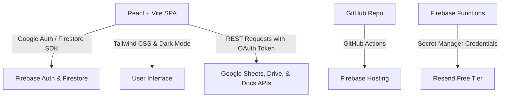

# Hevy-Inspired Personal Training Platform ("Consultoria") - Design Doc & Plan

This document outlines the architecture, database schema, integration flows, and implementation steps for building **Consultoria**, a mobile-first web application designed to replace manual Google Sheets tracking with an interactive experience for personal trainers and their students.

---

## 🎯 Project Goals

- **Wow Factor & Rich Aesthetics**: Build a responsive interface featuring a premium dark mode, Tailwind CSS utility styling, smooth micro-animations, and optimized layouts for mobile and tablet screens.
- **Strict Budget Adherence ($0.00 Cost)**: Scale the system for 1 trainer and up to 20 students, staying 100% within the free tiers of Firebase and Resend.
- **Language-Synced Google Storage**: Synced structure where spreadsheet columns, tabs, feedback document names, Google Drive folders, and exercise libraries dynamically match the user's preferred language (English or Portuguese).
- **Secure Secrets & Automation**: Avoid committing secrets (API keys, client secrets) to public GitHub repos by using GitHub Secrets, Firebase Secrets Manager, and local environment variables, deploying automatically using GitHub Actions.
- **Brand Customization**: Allow trainers to upload their custom logo, which is automatically inserted into generated spreadsheets alongside their name.

---

## 🛠️ Proposed Tech Stack



### 1. Frontend
* **Framework**: **React** + **Vite** for a lightweight, extremely fast Single Page Application (SPA).
* **Styling**: **Tailwind CSS (v4)** with full responsive utilities for mobile & tablet, and a native **Dark Mode** toggle (backed by system preference auto-detection).
* **Charts**: **Recharts** for rendering responsive workout progression graphs.

### 2. Backend & Auth (Firebase Spark Plan - Free Tier)
* **Firebase Authentication**: Handles Google Sign-in and manages OAuth scopes securely.
* **Cloud Firestore**: Stores user profiles, workspace configurations, system settings, and local workout logs cache.
* **Firebase Hosting**: Free, ultra-fast hosting with global CDN. Includes free SSL.
* **Firebase Cloud Functions**: Runs cron triggers for morning emails and secure Google API token refreshments.

### 3. Integrations (Google APIs)
* **Google Sheets API**: Read the `config` tab to generate workouts and insert the trainer's custom logo image; write back student workout completions.
* **Google Drive & Docs APIs**: Automatically build feedback folders and documents dynamically named in the user's chosen language.

---

## 📊 Database Models (Firestore)

### `users` Collection
```typescript
interface User {
  uid: string;
  email: string;
  displayName: string;
  photoURL: string;
  logoURL?: string; // Trainer uploaded logo URL (stored in Google Drive or Firebase Storage)
  role: 'trainer' | 'student';
  selectedLanguage: 'en' | 'pt-BR';
  createdAt: Timestamp;
}
```

### `workspaces` Collection
```typescript
interface Workspace {
  id: string; // Typically trainer's email
  trainerUid: string;
  trainerEmail: string;
  invitedStudents: string[]; // List of invited emails
  createdAt: Timestamp;
}
```

### `student_workspaces` Collection
```typescript
interface StudentWorkspace {
  id: string; // studentUid_workspaceId
  studentUid: string;
  studentEmail: string;
  workspaceId: string;
  status: 'active' | 'read-only';
  joinedAt: Timestamp;
}
```

### `training_cycles` Collection
```typescript
interface TrainingCycle {
  id: string;
  workspaceId: string;
  name: string;
  googleSheetId: string;
  startDate: Timestamp;
  endDate: Timestamp;
  isActive: boolean;
}
```

---

## 🔄 Core Customization & Language Localization Rules

### 1. Localization Dictionary for Google Workspace
Spreadsheet names, folders, and tabs dynamically match the user's preferred language (`selectedLanguage`):

| Entity Type | English Value | Portuguese (Brasil) Value |
| :--- | :--- | :--- |
| **Main Folder Name** | `Consultoria Training` | `Treinos Consultoria` |
| **Feedback Folder Name** | `Feedbacks - {StudentName}` | `Feedbacks - {StudentName}` |
| **Spreadsheet Columns** | `Session, Group, Exercise, Sets, Reps, Load, RPE, Rest, Observations` | `Treino, Grupo, Exercício, Séries, Repetições, Carga, RPE, Descanso, Observações` |
| **Spreadsheet Tabs** | `Session A, Session B, Config` | `Treino A, Treino B, Configuração` |
| **Exercise Library Header** | `Name, Muscle, Equipment, Video` | `Nome, Músculo, Equipamento, Vídeo` |

### 2. Trainer Logo Sheet Insertion
- When a weekly spreadsheet is generated, the app calls the Google Sheets API `spreadsheets.batchUpdate` with `insertEmbeddedImage` or `overGrid` request to position the trainer's logo beautifully at the top-left or top-right of the **Config** and **Session** sheets, alongside the trainer's name.

---

## 🔒 Secrets & Environment Management

To maintain absolute code safety in our public GitHub repository, secrets will be configured as follows:

1. **Client-Side Firebase Keys**: Standard Firebase client configs are non-sensitive and public (safe to commit to GitHub).
2. **Server-Side API Keys (Resend, Google OAuth Secrets)**: 
   - **Local Development**: Read from a `.env.local` file (listed in `.gitignore`).
   - **Production Firebase Functions**: Deployed securely using **Google Secret Manager** integrated directly with Firebase Functions (`defineSecret` API). Secrets are never printed in logs or committed to version control.
3. **Deployment Secrets**:
   - The `FIREBASE_CLI_TOKEN` (or service account key JSON) is stored securely in **GitHub Secrets** on your repository.

---

## 📦 Build & Deploy Workflows (GitHub Actions)

### 1. The Build Process
- Run `pnpm run build` locally or in CI. Vite bundles the React app, tree-shakes tailwind classes, compiles TypeScript, and places the optimized static bundle in the `dist/` directory.

### 2. CI/CD GitHub Actions Configuration
A GitHub Action workflow (`.github/workflows/deploy.yml`) is triggered on every push to the `main` branch:

```yaml
name: Build and Deploy to Firebase
on:
  push:
    branches:
      - main
jobs:
  build_and_deploy:
    runs-on: ubuntu-latest
    steps:
      - name: Checkout Code
        uses: actions/checkout@v4

      - name: Install pnpm
        uses: pnpm/action-setup@v3
        with:
          version: 9

      - name: Set up Node.js
        uses: actions/setup-node@v4
        with:
          node-version: '20'
          cache: 'pnpm'

      - name: Install Dependencies
        run: pnpm install --frozen-lockfile

      - name: Build Application
        run: pnpm run build
        env:
          VITE_FIREBASE_API_KEY: ${{ secrets.VITE_FIREBASE_API_KEY }}
          VITE_FIREBASE_AUTH_DOMAIN: ${{ secrets.VITE_FIREBASE_AUTH_DOMAIN }}
          VITE_FIREBASE_PROJECT_ID: ${{ secrets.VITE_FIREBASE_PROJECT_ID }}
          VITE_FIREBASE_STORAGE_BUCKET: ${{ secrets.VITE_FIREBASE_STORAGE_BUCKET }}
          VITE_FIREBASE_MESSAGING_SENDER_ID: ${{ secrets.VITE_FIREBASE_MESSAGING_SENDER_ID }}
          VITE_FIREBASE_APP_ID: ${{ secrets.VITE_FIREBASE_APP_ID }}

      - name: Deploy to Firebase Hosting
        uses: FirebaseExtended/action-hosting-deploy@v0
        with:
          repoToken: ${{ secrets.GITHUB_TOKEN }}
          firebaseServiceAccount: ${{ secrets.FIREBASE_SERVICE_ACCOUNT_KEY }}
          projectId: ${{ secrets.VITE_FIREBASE_PROJECT_ID }}
          channelId: live
```

---

## ⚡ Step-by-Step Implementation Plan

### Phase 1: Authentication & Workspace Structure (Week 1)
- [ ] Initialize Vite React SPA with Tailwind CSS v4 and Dark Mode support.
- [ ] Set up GitHub Actions deploy workflow skeleton.
- [ ] Configure Firebase Auth (Google Sign-In) and request Google OAuth Scopes.
- [ ] Set up user creation in Firestore with role assignment and bilingual settings.
- [ ] Build the Workspace Management Dashboard:
  - Invite students by email.
  - Revoke invitations, remove students, delete trainer account.
  - Handle active vs. read-only student permissions.

### Phase 2: Spreadsheet Integrations, Localization & Parser (Weeks 1-2)
- [ ] Develop the localized Google Sheets API wrapper.
- [ ] Implement exercise validation from the custom translation-synced `Exercise Library` sheet.
- [ ] Implement Trainer Logo uploading and embedding into Google Sheets headers.
- [ ] Build the Student Workout Execution Engine:
  - Pre/post-workout questionnaires.
  - Workout timer & interactive sets checker with customized inputs.
  - Real-time write back to Sheet cells.

### Phase 3: Feedback, Media, & Progress Photos (Week 3)
- [ ] Design the Google Drive directory structure creation workflow (bilingual naming).
- [ ] Build the trainer feedback portal using Google Docs API (automatically synced feedback files).
- [ ] Create the Progress Photos Module (shared timeline and organized Drive uploads).

### Phase 4: Reports, Daily Emails & Polish (Week 3)
- [ ] Create responsive Recharts components for RPE, Load, and Volume evolution.
- [ ] Implement daily morning email engine (Firebase Cloud Functions + Resend API).
- [ ] Refine responsive CSS transitions, glassmorphic aesthetics, and accessibility.

---

## 🔍 Verification Plan

### Automated Tests
- Integration tests for localized spreadsheet parser using mock Google API JSON responses.
- Security rules testing for Cloud Firestore to verify trainers cannot read other trainers' workspaces and students can only access their associated workspaces (including read-only logic).

### Manual Verification
- **E2E Browser Testing**: Authenticate as Trainer, invite dummy Student, log in as Student, accept workspace, initiate session, modify sets, complete session, and verify cell updates in the Google Sheet.
- **Drive Automation Test**: Check if correct folders and Google Docs are created under the dummy workspace when giving training feedback.
