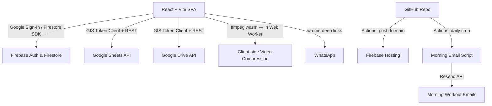

# Consultoria — Design Doc (v2)

This document defines the architecture, data models, integration flows, and implementation plan for **Consultoria v2** — a mobile-first web app that bridges two gaps in the existing personal training workflow:

1. **Enhanced Google Sheets experience** — a beautiful, mobile-friendly interface for students to view and fill their weekly training spreadsheet without fighting Google's mobile Sheets app.
2. **Structured video feedback loop** — students upload session videos; trainers deliver structured, per-exercise feedback; both parties are notified via WhatsApp deep links.

> **Context**: A separate product is being built to replace Google Sheets for training cycle management (exercises, sets, reps, loads, cycles). Consultoria does **not** replicate that — it consumes the trainer's existing Google Sheets and builds the interaction + communication layer on top.

---

## 🎯 Project Goals

- **Mobile-first UX**: Trainer and student primarily use their phones. Every screen is designed at 375px first.
- **Near-zero cost**: 1 trainer + 20–30 students, each with 1–2 active cycles. Expected monthly bill: **$0.00–$0.05**.
- **Google Sheets as source of truth**: The trainer's existing spreadsheet defines every session. Consultoria reads it for display and writes student responses to a dedicated `Respostas` tab. The trainer's layout is never modified.
- **No duplication of the other product**: No training cycle creation, no exercise library management, no student management — those live elsewhere.
- **WhatsApp-compatible notifications**: Trainer and students communicate via WhatsApp today. Consultoria integrates via `wa.me` deep links (no WhatsApp Business API, no dedicated bot number, no cost).

---

## 🛠️ Tech Stack



### Frontend
- **React 19 + Vite** — SPA, fast HMR, optimised production bundles.
- **TypeScript** — strict mode throughout.
- **Tailwind CSS v4** — responsive utilities, class-based dark mode.
- **Recharts** — session progress graphs (load, RPE, volume over time).
- **Lucide React** — icon set.
- **ffmpeg.wasm** — client-side video compression before Drive upload. Lazy-loaded in a Web Worker only when an upload is initiated.
- **canvas-confetti** — post-session celebration animation.

### Backend & Auth
- **Firebase Auth** — Google Sign-In.
- **Google Identity Services (GIS) Token Client** — silent client-side OAuth token refresh (see §OAuth Token Strategy).
- **Cloud Firestore** — user profiles, workspace metadata, cycle/session state, exercise actuals cache, video metadata, feedback.
- **Firebase Hosting** — CDN-backed static hosting.

### Integrations
- **Google Sheets API** — read session tabs for workout display; write student responses to `Respostas` tab.
- **Google Drive API** — create per-session video folders; upload compressed student videos; upload trainer feedback media files.
- **WhatsApp** — `wa.me` deep links for start/finish/feedback notifications (no Business API).
- **Resend** — optional morning workout emails (GitHub Actions cron).

---

## 🔑 OAuth Token Strategy (Zero-Cost, Client-Side)

Same approach as v1. Firebase Auth `signInWithPopup` returns a one-time Google OAuth access token (1-hour TTL). The GIS Token Client refreshes it silently without a popup as long as the user's Google session is active.

**Scopes requested:**
- `https://www.googleapis.com/auth/spreadsheets`
- `https://www.googleapis.com/auth/drive.file`

> `drive.file` grants access only to files created by the app (videos, feedback media). It does **not** grant broad Drive access. This keeps the permission footprint minimal and avoids Google's OAuth verification process for sensitive scopes.

**Token storage:** In-memory React refs only. Never `localStorage` or `sessionStorage`.

---

## 📊 Database Models (Firestore)

### `users` Collection
```ts
interface UserProfile {
  uid: string;
  email: string;
  displayName: string;
  photoURL: string;
  role: 'trainer' | 'student';
  selectedLanguage: 'en' | 'pt-BR';
  whatsappPhone: string;    // e.g. "5511999999999" — used to build wa.me links
  createdAt: Timestamp;
}
```

---

### `workspaces` Collection
One document per trainer. Lightweight — no Drive folder setup on registration.

```ts
interface Workspace {
  id: string;             // trainer's email (stable, human-readable)
  trainerUid: string;
  trainerEmail: string;
  trainerName: string;
  whatsappPhone: string;
  selectedLanguage: 'en' | 'pt-BR';
  createdAt: Timestamp;
}
```

---

### `student_workspaces` Collection
```ts
interface StudentWorkspace {
  id: string;             // `${studentUid}_${workspaceId}`
  studentUid: string;
  studentEmail: string;
  studentName: string;
  workspaceId: string;    // trainer's email
  status: 'pending' | 'active';
  // 'pending' → student submitted connection request, trainer has not yet approved
  // 'active'  → trainer approved, student can add cycles and train
  joinedAt?: Timestamp;
  createdAt: Timestamp;
}
```

---

### `cycles` Collection
One document per Google Sheets spreadsheet (= one training cycle). Students create these themselves after connecting to a trainer.

```ts
interface Cycle {
  id: string;
  studentUid: string;
  workspaceId: string;
  googleSheetId: string;      // extracted from the URL
  googleSheetUrl: string;     // original URL pasted by student
  title: string;              // fetched from sheet title, editable by student
  status: 'active' | 'completed';
  startDate: Timestamp;
  completedAt?: Timestamp;
  createdAt: Timestamp;
}
```

---

### `sessions` Collection
One document per training session instance (i.e., one occurrence of doing "Treino A" on a specific date).

```ts
interface Session {
  id: string;                  // auto-generated
  cycleId: string;
  studentUid: string;
  workspaceId: string;
  tabName: string;             // e.g. "Treino A" — matches the sheet tab exactly
  status: 'in_progress' | 'completed';
  date: Timestamp;             // day the session was started
  startedAt: Timestamp;
  finishedAt?: Timestamp;
  preWorkout?: {
    energyLevel: 1 | 2 | 3 | 4 | 5;
    feeling: 'bem' | 'mal';
  };
  postWorkout?: {
    energyLevel: 1 | 2 | 3 | 4 | 5;
    feeling: 'igual' | 'melhor' | 'pior';
  };
  driveFolderId?: string;      // created on first video upload
  driveFolderUrl?: string;
  hasVideos: boolean;
  videosNotifiedAt?: Timestamp;  // when trainer was notified via WhatsApp
}
```

---

### `session_exercises` Collection
One document per exercise set per session. This is the canonical record for reports.

```ts
interface SessionExercise {
  id: string;                  // `${sessionId}_${exerciseSlug}_${setIndex}`
  sessionId: string;
  cycleId: string;
  studentUid: string;
  workspaceId: string;
  tabName: string;             // denormalised for cross-session lookups
  exerciseName: string;        // exact string from the sheet — used for history matching
  setIndex: number;            // 0-based
  // Planned (from sheet):
  plannedReps?: number;
  plannedLoad?: number;
  plannedRpe?: number;
  plannedRest?: string;
  group?: string;              // e.g. "Aquecimento", "Treino", "Extra"
  // Student-filled:
  actualReps?: number;
  actualLoad?: number;
  actualRpe?: number;
  observations?: string;
  isDone: boolean;
  sessionDate: Timestamp;      // denormalised — enables efficient time-series queries
}
```

---

### `videos` Collection
One document per uploaded video.

```ts
interface SessionVideo {
  id: string;
  sessionId: string;
  cycleId: string;
  studentUid: string;
  workspaceId: string;
  exerciseName?: string;           // null for free-form / extra videos
  freeFormDescription?: string;    // caption for extra videos
  driveFileId: string;
  driveFileUrl: string;            // shareable "anyone with link" URL
  driveThumbnailUrl?: string;      // Drive thumbnail for in-app preview
  originalSizeMB: number;
  compressedSizeMB: number;
  uploadedAt: Timestamp;
}
```

---

### `feedback` Collection
One document per session. Trainer fills this after reviewing the student's videos.

```ts
interface Feedback {
  id: string;                      // same as sessionId
  sessionId: string;
  cycleId: string;
  studentUid: string;
  workspaceId: string;
  trainerUid: string;
  status: 'draft' | 'complete';
  exerciseFeedback: ExerciseFeedback[];
  generalNotes: string;
  createdAt: Timestamp;
  completedAt?: Timestamp;
}

interface ExerciseFeedback {
  exerciseName: string;
  textFeedback: string;
  mediaFiles: FeedbackMediaFile[];
}

interface FeedbackMediaFile {
  driveFileId: string;
  driveFileUrl: string;            // shareable URL
  mediaType: 'audio' | 'video';
  fileName: string;
  sizeMB: number;
}
```

---

### `admins` Collection
*(Carried over from v1 — unchanged.)*

```ts
// Document ID = admin user's UID
interface AdminRecord {
  uid: string;
  email: string;
  grantedAt: Timestamp;
  grantedBy: string;
}
```
> Created exclusively via Firebase Console or a bootstrap script. Never writable from the client.

---

## 👤 Student Registration & Trainer Connection Flow

```
Student signs in with Google (first time)
        ↓
Prompted: "Enter your trainer's email"
        ↓
App looks up workspace by trainerEmail
  → Not found: "Trainer not found — ask them to sign up for Consultoria first"
  → Found: create student_workspaces doc { status: 'pending' }
        ↓
Trainer sees pending request in their dashboard
        ↓
Trainer taps "Approve" → status: 'active', joinedAt: now()
        ↓
Student can now add cycles
```

**Key rules:**
- A student with `status: 'pending'` sees a waiting screen — no cycle or session access.
- A student can connect to multiple trainers (one `student_workspaces` doc per trainer).
- If a trainer is not yet in Consultoria, the student gets a clear error and a shareable app link to send to the trainer.

---

## 📋 Cycle Management

After being approved, the student adds their training cycle:

1. Student taps **"Add Cycle"**
2. Pastes the Google Sheets URL shared by their trainer
3. App extracts the `spreadsheetId` from the URL and calls Sheets API to fetch the spreadsheet title + list of tab names
4. Student confirms or edits the cycle title
5. A `cycles` doc is created; the app immediately displays the session tab cards

**One active cycle per trainer-student pair** at a time. A student with multiple trainers can have one active cycle per trainer.

---

## 🏋️ Training Session View

### Spreadsheet structure (confirmed from live template analysis)

The trainer's spreadsheet has this exact row layout per training tab:

```
Row 1   Metadata: block/session ID in col C (e.g. "b1 - s1 - mg"),
                  "Visto do Aluno" label in col G
Row 2   Config:   workout motto in col A, training day label in col C (e.g. "treino 2"),
                  student-viewed checkbox (TRUE/FALSE) in col G
Rows 3–4  Empty
Row 5   ── "Preencha abaixo (INÍCIO DO TREINO)" section header ──
Row 6   "Qual o seu nível de ânimo?"  |  integer 1–5 (displayed as ★s) in col B
Row 7   "Como está se sentindo?"      |  dropdown string in col B
Row 8   Section label: "Aquecimento"  (or other warm-up label)
Row 9   Column headers: Exercício · Séries · Repetições · Carga · Descanso · Observações · RPE
Rows 10+ Warm-up exercise rows
Row N   Section label: "Treino"  (main workout)
Row N+1 Empty
Row N+2 Column headers (repeated)
Rows N+3+ Main exercise rows (some exercises span multiple rows for progressive sets)
Row M   "rm"  ← special: student records 1RM / personal best
Row M+1 ── "Preencha abaixo (FINAL DO TREINO)" section header ──
Row M+2 "Qual o seu nível de ânimo?"  |  integer 1–5 in col B
Row M+3 "Como está se sentindo?"      |  dropdown string in col B
```

**Confirmed column positions (A–G, columns H+ are empty in current template):**

| Col | Label | Notes |
|-----|-------|-------|
| A | Exercício | Exercise name; **empty on continuation rows** of a multi-set exercise |
| B | Séries | Sets (integer). Also used for energy level answers (rows 6, M+2) |
| C | Repetições | Reps (integer or string e.g. "30 segundos", "10s +") |
| D | Carga | Load in kg; special values: `"rpe"` (choose by feel), `"ESCOLHER"` (student picks) |
| E | Descanso | Rest period |
| F | Observações | Trainer notes |
| G | RPE | Target RPE (integer 1–10); `"PREENCHER"` = student must fill this in |

**There is also a separate "Strikes" tab** (first tab, gid=0) that tracks student compliance: consecutive absences, exercise/weight change penalties, and main lift PRs. The app ignores this tab.

### Reading the spreadsheet

When a student opens a session, the app calls:
```
GET https://sheets.googleapis.com/v4/spreadsheets/{sheetId}/values/{tabName}!A:R
```

The raw 2D array is parsed with the following logic:

1. **Skip rows 1–2** (metadata/config). On open, write `TRUE` to cell `G2` ("Visto do Aluno").
2. **Detect pre-workout block**: find row where col A contains `"INÍCIO DO TREINO"` (case-insensitive). Next two rows are energy level and feeling.
3. **Detect section labels**: rows where col A is a known label (`"Aquecimento"`, `"Treino"`, etc.) and cols B–G are all empty/null.
4. **Detect exercise header rows**: rows where col A = `"Exercício"` — skip these.
5. **Parse exercise rows**: non-empty rows after a section label and header row, up to the next section/post-workout marker.
   - If col A is non-empty → start of a new exercise group.
   - If col A is empty → continuation row of the previous exercise (different set/weight in the same progression).
   - Group all continuation rows under the exercise name from the first row.
6. **Detect "rm" row**: row where col A = `"rm"` — render as a special "Record your max" input card.
7. **Detect post-workout block**: row where col A contains `"FINAL DO TREINO"`.

### Pre-workout form

Shown before the exercise list. Two large-tap-target questions:
- **Nível de ânimo**: 5-star selector (1–5). Value stored as integer; displayed using the same ★ format as the sheet.
- **Como está se sentindo?**: Two big buttons — **Bem** / **Mal**.

Answers saved to `sessions.preWorkout` in Firestore. Not written to the sheet at this stage.

### Exercise list

Each exercise group is rendered as a card:
- Planned values shown read-only: Sets · Reps · Load · Rest · Observations · Target RPE
- Special states: `"rpe"` load → show "Escolha pelo RPE"; `"ESCOLHER"` → show "Escolha o peso"; `"PREENCHER"` RPE → input required
- Student fills per set:
  - **Repetições realizadas** (number)
  - **Carga realizada** (number, pre-filled from planned if deterministic)
  - **RPE realizado** (1–10 slider or number)
  - **Observações** (text)
  - **Concluído** toggle (checkbox)
- **"💬 Feedback anterior"** chip shown if prior trainer feedback exists for this exercise name — tapping opens a bottom sheet

### "rm" card

Rendered between the last exercise and the post-workout form. Student enters their best lift for the session (or leaves blank). Saved to `session_exercises` with a special `isPersonalRecord: true` flag.

### Post-workout form

Same two questions as pre-workout. Feeling options: **Igual** / **Melhor** / **Pior**.

### Session action buttons

- **"Iniciar Treino"** — shown before pre-workout form is submitted. Writes `TRUE` to `G2` ("Visto do Aluno"), sets `session.status = 'in_progress'`, triggers trainer `wa.me` deep link.
- **"Finalizar Treino"** — shown after all exercises have `isDone = true` and post-workout is complete. Triggers write-back to `Respostas` tab, saves all `session_exercises` to Firestore, sets `session.status = 'completed'`, triggers trainer notification deep link.

---

## 📝 Spreadsheet Write-back Strategy

Student answers are written to a **`Respostas`** tab appended to the trainer's spreadsheet. This tab is created by the app on the first session completion if it doesn't already exist. The trainer's original tabs are never modified.

### Respostas Tab Format

One header row (created once). One data row per exercise set per session:

| Date | Tab | Exercise | Set | Planned Reps | Planned Load | Planned RPE | Actual Reps | Actual Load | Actual RPE | Observations | Done | Pre Energy | Pre Feeling | Post Energy | Post Feeling |
|---|---|---|---|---|---|---|---|---|---|---|---|---|---|---|---|

**Language**: All headers in Portuguese. Column order:

| # | Header | Source |
|---|--------|--------|
| 1 | Data | Session date |
| 2 | Treino | Tab name (e.g. "treino 2") |
| 3 | Exercício | Exercise name |
| 4 | Série | Set index (1-based) |
| 5 | Reps Previstas | Planned reps (col C) |
| 6 | Carga Prevista | Planned load (col D) |
| 7 | RPE Previsto | Target RPE (col G) — "PREENCHER" stored as blank |
| 8 | Reps Realizadas | Actual reps (student-filled) |
| 9 | Carga Realizada | Actual load (student-filled) |
| 10 | RPE Realizado | Actual RPE (student-filled) |
| 11 | Observações | Student notes |
| 12 | Concluído | TRUE/FALSE |
| 13 | Ânimo Início | Pre-workout energy level (1–5) |
| 14 | Sentimento Início | Pre-workout feeling |
| 15 | Ânimo Final | Post-workout energy level (1–5) |
| 16 | Sentimento Final | Post-workout feeling |

Pre/post workout data is repeated in every row of the same session (denormalised) so each row is self-contained and the trainer can filter or pivot by date/tab without needing to join.

> **Canonical data lives in Firestore.** The `Respostas` tab is a convenience export for the trainer. If the sheet is deleted or the tab corrupted, the app rebuilds from Firestore. Reports are always generated from Firestore data.

---

## 📹 Video Upload Flow

### Drive folder creation

On the **first video upload** for a session, the app calls the Drive API (with the student's OAuth token, `drive.file` scope) to create a folder:

```
Treino A — 2026-05-21 — [StudentName]/    ← in student's My Drive
```

The folder is set to **"Anyone with the link" → Viewer** so the trainer can access it via the stored URL without needing explicit sharing (which would require the broader `drive` scope).

The folder ID and URL are stored in the `sessions` doc.

### Client-side video compression

Before upload, each video is compressed using **ffmpeg.wasm** running in a **Web Worker** (lazy-loaded on first upload — not included in the initial bundle).

Target output:
- Resolution: 720p (1280×720), down-scaled from the original if larger
- Codec: H.264 / AAC
- Bitrate: ~1.5 Mbps video + 128 kbps audio
- A 60-second phone video → approximately **10–15 MB** (compared to 80–150 MB uncompressed)

A progress bar is shown during compression. The original file is never uploaded.

### Exercise association

For each video, the student selects:
- **Exercise** (dropdown populated from the exercises in that session's tab) — for session-specific videos
- **Free-form description** (text field) — for extra footage (warm-up, full session, etc.)

### Notification

After uploading one or more videos, a **"Notificar treinador"** (Notify Trainer) button generates a `wa.me` deep link to the trainer's WhatsApp with a pre-filled message including the session name, date, and a deep link back to the session in the app.

---

## 📂 Google Drive Folder Structure

```
[Student's My Drive]
└── Treino A — 2026-05-21 — Ana/       ← created per session, on first video upload
    ├── agachamento_set1.mp4            ← student's compressed videos
    ├── agachamento_set2.mp4
    └── extensora.mp4

[Trainer's My Drive]
└── Consultoria Feedback/               ← created on trainer registration (one-time)
    └── Ana — Treino A — 2026-05-21/   ← created when trainer first opens feedback for a session
        ├── feedback_agachamento.mp4    ← trainer's uploaded feedback files
        └── feedback_geral.m4a
```

- Student videos → **student's Drive** (no special sharing permissions required)
- Trainer feedback files → **trainer's Drive** (no special sharing permissions required)
- Both use `drive.file` scope; both sets of files are set to "anyone with link" → Viewer for cross-party access

---

## 💬 Trainer Feedback Flow

### Entry point

Trainer's dashboard shows a **"Aguardando feedback"** (Awaiting Feedback) list — sessions where `session.status == 'completed'` and `session.hasVideos == true` and no `feedback` doc exists (or `feedback.status == 'draft'`).

### Feedback view

For each session, the trainer sees:

1. **Session header**: student name, tab name, date, pre/post workout answers
2. **Per-exercise sections**: one card per exercise that has at least one video
   - Video player (streams from Drive via shareable URL)
   - Text feedback field
   - **"Adicionar arquivo"** button — opens device file picker (audio/video only). Uploaded to trainer's Drive feedback folder, stored as `FeedbackMediaFile` in the `feedback.exerciseFeedback` array.
3. **Notas gerais** (General Notes): free-form text field for the whole session

### "Feedback Completo" button

Sets `feedback.status = 'complete'` and `completedAt = now()`. Generates a `wa.me` deep link to the student's WhatsApp with a pre-filled message and a deep link to the feedback view in the app.

---

## 📖 Student Feedback View

When the student taps the feedback notification link (or navigates to the session in the app):
- Shows the same session summary (pre/post answers, exercise list)
- For each exercise with feedback: text feedback displayed + any audio/video files rendered inline
- General notes section
- Read-only; student cannot edit

---

## 🔁 Historical Feedback in Sessions

When a student opens a session and the exercise list is rendered, the app queries:

```
collection('session_exercises')
  .where('studentUid', '==', currentStudentUid)
  .where('exerciseName', '==', exerciseName)   // exact match, case-sensitive
  .orderBy('sessionDate', 'desc')
  .limit(5)
```

Then checks `feedback` collection for sessions in those results that have exercise-level feedback for this exercise.

If prior feedback exists → a **"💬 Feedback anterior"** chip appears on the exercise card. Tapping opens a bottom sheet showing:
- Most recent feedback first
- Date, trainer text feedback, and any linked media files
- Up to 5 previous sessions

---

## 📊 Reports & Progress Charts

Available from the student's cycle view and the trainer's student overview.

Charts are rendered with **Recharts**, querying from `session_exercises`:

| Chart | X axis | Y axis | Filter |
|---|---|---|---|
| Load progression | Session date | Actual load (heaviest set) | Per exercise |
| RPE over time | Session date | Average actual RPE | Per exercise |
| Volume | Session date | Sum (actual reps × actual load) | Per exercise |
| Energy level | Session date | Pre-workout energy level | All sessions |
| Session completion rate | Week | % exercises marked done | All sessions |

---

## 📱 WhatsApp Deep-Link Specification

All WhatsApp interactions use `wa.me` deep links. On mobile, tapping opens WhatsApp with the contact and message pre-filled; the user taps "Send" once.

| Trigger | Sender | Recipient | Message template |
|---|---|---|---|
| "Iniciar Treino" | Student → Trainer | trainer's `whatsappPhone` | `🏋️ Iniciei o treino *{tabName}* em {date}` |
| "Finalizar Treino" | Student → Trainer | trainer's `whatsappPhone` | `✅ Finalizei o treino *{tabName}* em {date}. {videoCount} vídeo(s) disponível(eis): {appDeepLink}` |
| "Notificar treinador" (after video upload) | Student → Trainer | trainer's `whatsappPhone` | `📹 Enviei {n} vídeo(s) do treino *{tabName}* de {date}. Aguardo seu feedback: {appDeepLink}` |
| "Feedback Completo" | Trainer → Student | student's `whatsappPhone` | `📝 Seu feedback do treino *{tabName}* de {date} está pronto: {appDeepLink}` |

`appDeepLink` is a direct URL to the relevant session or feedback page in the app.

---

## 📊 Google Sheets Template (Portuguese, AA Contrast)

### Context

The existing template (`gid=1061322602`) has been analysed. The new template:
- Preserves the exact row/section structure the trainer already knows
- Adds student input columns H–L to the right of the trainer's A–G columns (trainer's layout untouched)
- Fixes all contrast issues with an AA-verified colour palette
- Is in Portuguese throughout

> ⚠️ **Visual colour analysis still needed**: cell background/text colours cannot be read from CSV. Before finalising the existing-template contrast fixes, the trainer must open the sheet and share a screenshot, or open it in a Chrome session connected to Claude.

### Column layout

**Trainer fills (A–G) — read-only from student's perspective in the app:**

| Col | PT Label | EN notes |
|-----|----------|----------|
| A | Exercício | Exercise name (empty on continuation sets) |
| B | Séries | Sets |
| C | Repetições | Reps |
| D | Carga | Load (kg, or "rpe" / "ESCOLHER") |
| E | Descanso | Rest |
| F | Observações | Trainer notes |
| G | RPE | Target RPE ("PREENCHER" = student must fill) |

**Student fills (H–L) — new columns added by the new template:**

| Col | PT Label | Type |
|-----|----------|------|
| H | Reps Realizadas | Number |
| I | Carga Realizada | Number |
| J | RPE Realizado | Number 1–10 |
| K | Observações do Aluno | Text |
| L | Concluído ✓ | Checkbox |

In the app, the student fills H–L via the UI and the app writes them back via Sheets API. In the original trainer template (no H–L columns), the app writes only to the `Respostas` tab and Firestore.

### Row structure (new template)

```
Row 1   Metadata header (block/session ID in C, "Visto do Aluno" in G, student name in A)
Row 2   Config (motto in A, training day in C, viewed checkbox G — app writes TRUE on open)
Row 3   Empty
Row 4   Empty
Row 5   "Preencha abaixo (INÍCIO DO TREINO)"   ← section header, merged A:L, bold
Row 6   "Qual o seu nível de ânimo?"   |  [★★☆☆☆ number input in B]
Row 7   "Como está se sentindo?"       |  [Bem / Mal dropdown in B]
Row 8   "Aquecimento"                  ← section label, merged A:L
Row 9   Column headers (A–G trainer · H–L student)
Row 10+ Warm-up exercises
Row N   "Treino"                       ← section label
Row N+1 Empty
Row N+2 Column headers (repeated)
Row N+3+ Main exercises
Row M   "rm"                           ← 1RM / record row (cols H–I for student to fill)
Row M+1 "Preencha abaixo (FINAL DO TREINO)"   ← section header
Row M+2 "Qual o seu nível de ânimo?"   |  [★★★★★ number input in B]
Row M+3 "Como está se sentindo?"       |  [Igual / Melhor / Pior dropdown in B]
```

### AA-compliant colour palette

All ratios verified against WCAG 2.1 Level AA (≥ 4.5:1 for normal text, ≥ 3:1 for large/bold).

| Element | Background | Text | Ratio |
|---------|-----------|------|-------|
| Sheet default | `#FFFFFF` | `#1E293B` | 16.1:1 ✅ |
| Section headers ("Aquecimento", "Treino") | `#1E293B` | `#FFFFFF` | 16.1:1 ✅ |
| Pre/post workout rows | `#F5F3FF` | `#1E293B` | 14.8:1 ✅ |
| Column header row | `#334155` | `#FFFFFF` | 10.1:1 ✅ |
| Trainer planned cells (A–G body) | `#F8FAFC` | `#475569` | 4.63:1 ✅ |
| Student input cells (H–L) | `#EFF6FF` | `#1E293B` | 14.8:1 ✅ |
| "PREENCHER" / required RPE cells | `#FFF7ED` | `#9A3412` | 5.0:1 ✅ |
| Star rating rows (energy level) | `#F5F3FF` | `#6D28D9` | 5.3:1 ✅ |
| Done / Concluído column (checked) | `#DCFCE7` | `#166534` | 5.4:1 ✅ |
| "rm" personal record row | `#FEF9C3` | `#854D0E` | 5.5:1 ✅ |
| "Visto do Aluno" row (config) | `#F0FDF4` | `#166534` | 6.7:1 ✅ |

---

## 📧 Morning Email Engine (Optional — GitHub Actions)

*(Carried over from v1. Can be activated independently of the rest of the app.)*

Daily cron via GitHub Actions (`scripts/send-morning-emails.ts`) + Resend API. Sends each student their day's workout tab content from their active cycle spreadsheet. Student configures which tabs map to which days of the week in their Consultoria profile.

---

## 🔐 Admin Mode

*(Carried over from v1 — full specification unchanged.)*

Admins are granted via the `admins` Firestore collection (console-only). Admin panel at `/admin` lists all users; "View as" impersonates any trainer or student with a persistent banner and all write actions disabled.

---

## 🔒 Secrets & Environment

| Secret | Where stored | Used by |
|---|---|---|
| `VITE_FIREBASE_API_KEY` + other `VITE_FIREBASE_*` | `.env.local` / GitHub Secrets | Firebase SDK (client) |
| `VITE_GOOGLE_CLIENT_ID` | `.env.local` / GitHub Secrets | GIS Token Client (browser) |
| `RESEND_API_KEY` | GitHub Secrets | Morning email script |
| `FIREBASE_SERVICE_ACCOUNT_KEY` | GitHub Secrets | CI deploy + email script |

See `docs/setup_guide.md` for step-by-step instructions to obtain all values.

---

## 🚀 Build & Deploy (GitHub Actions)

Same as v1 — push to `main` triggers build + Firebase Hosting deploy. See `docs/setup_guide.md`.

---

## 🛡️ Firestore Security Rules

```js
rules_version = '2';
service cloud.firestore {
  match /databases/{database}/documents {

    match /users/{uid} {
      allow read: if request.auth.uid == uid || isAdmin();
      allow write: if request.auth.uid == uid;
    }

    match /admins/{uid} {
      allow read: if request.auth.uid == uid;
      allow write: if false;
    }

    match /workspaces/{workspaceId} {
      allow read: if isAdmin() || isTrainerOf(workspaceId) || isStudentOf(workspaceId);
      allow create: if request.auth.uid == request.resource.data.trainerUid;
      allow update, delete: if isTrainerOf(workspaceId);
    }

    match /student_workspaces/{docId} {
      // Student can create their own request; trainer can update status; both can read
      allow read: if isAdmin() ||
        isTrainerOf(resource.data.workspaceId) ||
        request.auth.uid == resource.data.studentUid;
      allow create: if request.auth.uid == request.resource.data.studentUid;
      allow update: if isTrainerOf(resource.data.workspaceId);
      allow delete: if isTrainerOf(resource.data.workspaceId) ||
        request.auth.uid == resource.data.studentUid;
    }

    match /cycles/{docId} {
      allow read: if isAdmin() ||
        isTrainerOf(resource.data.workspaceId) ||
        request.auth.uid == resource.data.studentUid;
      allow create, update: if request.auth.uid == resource.data.studentUid;
      allow delete: if request.auth.uid == resource.data.studentUid ||
        isTrainerOf(resource.data.workspaceId);
    }

    match /sessions/{docId} {
      allow read: if isAdmin() ||
        isTrainerOf(resource.data.workspaceId) ||
        request.auth.uid == resource.data.studentUid;
      allow create, update: if request.auth.uid == resource.data.studentUid &&
        isActiveStudentOf(resource.data.workspaceId, resource.data.studentUid);
    }

    match /session_exercises/{docId} {
      allow read: if isAdmin() ||
        isTrainerOf(resource.data.workspaceId) ||
        request.auth.uid == resource.data.studentUid;
      allow create, update: if request.auth.uid == resource.data.studentUid;
    }

    match /videos/{docId} {
      allow read: if isAdmin() ||
        isTrainerOf(resource.data.workspaceId) ||
        request.auth.uid == resource.data.studentUid;
      allow create: if request.auth.uid == resource.data.studentUid;
      allow update, delete: if request.auth.uid == resource.data.studentUid;
    }

    match /feedback/{docId} {
      allow read: if isAdmin() ||
        isTrainerOf(resource.data.workspaceId) ||
        request.auth.uid == resource.data.studentUid;
      allow create, update: if isTrainerOf(resource.data.workspaceId);
    }

    // ── Helpers ──────────────────────────────────────────────────────────────

    function isAdmin() {
      return exists(/databases/$(database)/documents/admins/$(request.auth.uid));
    }

    function isTrainerOf(workspaceId) {
      return get(/databases/$(database)/documents/workspaces/$(workspaceId))
        .data.trainerUid == request.auth.uid;
    }

    function isStudentOf(workspaceId) {
      return exists(/databases/$(database)/documents/student_workspaces/
        $(request.auth.uid + '_' + workspaceId));
    }

    function isActiveStudentOf(workspaceId, studentUid) {
      return request.auth.uid == studentUid &&
        get(/databases/$(database)/documents/student_workspaces/
          $(studentUid + '_' + workspaceId)).data.status == 'active';
    }
  }
}
```

---

## ⚡ Implementation Plan

### Phase 1 — Foundation & Auth
- [ ] Vite + React 19 + TypeScript + Tailwind CSS v4 project setup
- [ ] Firebase Auth (Google Sign-In) + Firestore SDK
- [ ] GIS Token Client for Sheets + Drive API access
- [ ] User profile creation (role, language, WhatsApp phone number)
- [ ] Trainer workspace auto-creation on first trainer sign-in
- [ ] Student connection flow: enter trainer email → create pending `student_workspaces` doc
- [ ] Trainer dashboard: approve/reject pending student connections
- [ ] `ProtectedRoute` + role-based routing
- [ ] Mobile-first app shell: glassmorphism layout, dark mode, language toggle, nav

### Phase 2 — Cycle & Session Management
- [ ] Student adds a cycle: paste Google Sheets URL → fetch sheet title + tab names
- [ ] Cycle overview page: list of session tab cards
- [ ] Session view: parse spreadsheet tab → render exercise cards (planned values, input fields)
- [ ] Pre/post workout forms (energy + feeling)
- [ ] Exercise actuals input: reps, load, RPE, observations, done toggle
- [ ] "Iniciar Treino" and "Finalizar Treino" `wa.me` deep links
- [ ] Write-back: create `Respostas` tab if absent; append session row(s) to sheet
- [ ] Save session + `session_exercises` to Firestore

### Phase 3 — Video Upload
- [ ] Drive folder creation per session (student's Drive, `drive.file` scope)
- [ ] File picker → ffmpeg.wasm compression (Web Worker, lazy-loaded) → Drive upload
- [ ] Progress UI during compression and upload
- [ ] Exercise association (dropdown from session exercises) + free-form description
- [ ] Video list view per session
- [ ] "Notificar treinador" `wa.me` deep link after upload

### Phase 4 — Trainer Feedback
- [ ] Trainer dashboard: "Awaiting Feedback" session list
- [ ] Feedback view: session summary + per-exercise video player
- [ ] Per-exercise text feedback field
- [ ] Media file upload (device picker — audio/video) → trainer's Drive feedback folder
- [ ] General notes field
- [ ] "Feedback Completo" button → update Firestore + `wa.me` deep link to student
- [ ] Student feedback view (read-only)

### Phase 5 — Historical Feedback & Reports
- [ ] Historical feedback query per exercise name → "💬 Feedback anterior" chip in session view
- [ ] Feedback history bottom sheet (last 5 instances)
- [ ] Reports page: Recharts charts (load, RPE, volume, energy level over time)
- [ ] Cycle summary statistics
- [ ] Optional: morning email script + GitHub Actions cron

### Phase 6 — Template, Polish & Admin
- [ ] Analyse existing trainer template (requires public share link)
- [ ] Build new Portuguese AA-contrast template in Google Sheets
- [ ] Document template column mapping for the sheet parser
- [ ] Admin mode: `AdminRoute`, `AdminImpersonationContext`, `AdminDashboard`, impersonation banner
- [ ] Firestore Security Rules deployment + integration tests
- [ ] Accessibility pass (focus management, ARIA, colour contrast)
- [ ] Responsive QA: 375px mobile + 768px tablet
- [ ] Performance audit: lazy-load ffmpeg.wasm, route splitting, Lighthouse score

---

## 🔍 Verification Plan

### Manual E2E Scenarios
1. **Student connection**: student signs in → enters trainer email → trainer approves → student can add cycle
2. **Cycle registration**: student pastes sheet URL → app reads tabs → session cards appear
3. **Full session flow**: student opens session → fills pre-workout → fills exercise actuals → fills post-workout → taps "Finalizar" → WhatsApp deep link opens with correct message → `Respostas` tab updated in sheet → `session_exercises` written to Firestore
4. **Video upload**: student uploads 2 videos → compression runs → files appear in Drive folder → "Notificar treinador" link works
5. **Trainer feedback**: trainer opens awaiting-feedback session → watches videos → adds text feedback + uploads audio file → taps "Feedback Completo" → student WhatsApp link opens
6. **Historical feedback**: student does "Treino A" a second time → "💬 Feedback anterior" appears on exercises that had feedback → bottom sheet shows correct previous feedback
7. **Reports**: after 3+ sessions, reports page shows load/RPE charts per exercise
8. **Admin impersonation**: admin views a student account → all data renders correctly → all write actions disabled
9. **Token refresh**: leave app open for 55+ minutes → trigger a Sheets write → silent token refresh succeeds without visible popup

### Automated Tests
- Firestore Security Rules (Firebase Emulator): cross-workspace isolation, pending student blocks, trainer-only feedback writes
- Sheets parser unit tests: mock API response → verify correct column detection, exercise row extraction, pre/post section detection

---

## ❓ Open Items (Needs Confirmation)

1. **Spreadsheet template access**: The existing template must be shared publicly (Viewer) before Phase 6 template work and the sheet parser column mapping can be finalised.
2. **Morning emails**: Still wanted? (Can be activated in Phase 5 independently of the rest.)
3. **Progress photos**: Original design had a Drive-based photo timeline + side-by-side comparison. Still in scope?
4. **Multiple active cycles**: Can a student have more than one active cycle per trainer (e.g. two different programs running in parallel)?
