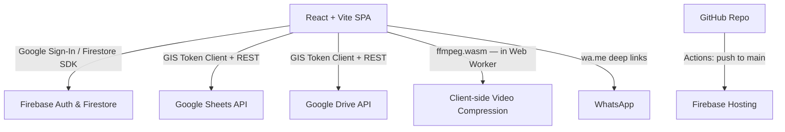

# Consultoria — Design Doc (v2)

This document defines the architecture, data models, integration flows, and implementation plan for **Consultoria v2** — a mobile-first web app that bridges two gaps in the existing personal training workflow:

1. **Enhanced Google Sheets experience** — a beautiful, mobile-friendly interface for students to view and fill their weekly training spreadsheet without fighting Google's mobile Sheets app.
2. **Structured video feedback loop** — students upload session videos; trainers deliver structured, per-exercise feedback; both parties are notified via WhatsApp deep links.

> **Context**: A separate product is being built to replace Google Sheets for training cycle management (exercises, sets, reps, loads, cycles). Consultoria does **not** replicate that — it consumes the trainer's existing Google Sheets and builds the interaction + communication layer on top.

---

## 🆕 Recent Decisions — Week Lifecycle & Session Flow

Changes shipped after the initial v2 build (these supersede the older wording in
the sections below where they conflict):

- **Week lifecycle.** A cycle progresses week by week via a `cycles/{id}/weeks`
  sub-collection. A week is *Não iniciada* → *Em andamento* → *Concluída*.
  - **"Começar Semana N"** creates the week and **re-reads the spreadsheet**,
    pre-creating one `pending` session per training tab. Shown only for the first
    week, or once the current week is concluded (we can't know the next week's
    plan until the trainer updates the sheet).
  - **"Concluir Semana N"** appears only once **every** session is `completed`
    or `skipped`; it marks the week `completed`, after which its sessions are
    **read-only** (open-only; no start/skip/unskip, no video uploads).
  - Past (concluded) weeks render below the current one as **read-only accordions**.
- **Deferred session start.** Opening a session ("Abrir") does **not** start it.
  It's marked `in_progress` — and the trainer's WhatsApp "started" message fires —
  only when the student fills the two pre-workout questions and taps "Começar
  treino". A started session counts as the *current* workout for **4 hours**.
- **Session statuses** are now `pending | in_progress | completed | skipped`.
  Skipped sessions can be reverted ("Despular"). Opening a skipped session is
  read-only until un-skipped.
- **Session list is a table**: `name · status · Abrir`. Tapping the name = Abrir;
  Abrir is always right-aligned; completed rows show "Concluído em dd/mm".
- **RPE input** is a color-coded 1–10 dropdown (1-3 dark green, 4-5 light green,
  6-7 orange, 8-10 red) that still accepts typed values.
- **Removed**: the trainer feedback media-upload feature, and the student
  "Histórico de sessões" list (the week panel is now the single source of truth).
- **Drive**: 4-level folder hierarchy (root → cycle → week → session); uploaded
  files are prefixed with the session name.
- **Auth**: Sheets/Drive/Docs scopes are now granted during the Firebase sign-in
  popup (see OAuth section) — existing users must re-consent once.
- **WhatsApp**: messages are plain-text (no emoji) to avoid `�` on some devices.
- A header **back button** was added to the session and cycle pages.

---

## 🎯 Project Goals

- **Mobile-first UX**: Trainer and student primarily use their phones. Every screen is designed at 375px first.
- **Near-zero cost**: 1 trainer + 20–30 students. Expected monthly bill: **$0.00–$0.05**.
- **Google Sheets as source of truth**: The trainer's existing spreadsheet defines every session. Consultoria reads it for display and writes student responses to a dedicated `Respostas` tab. The trainer's layout is never modified.
- **No duplication of the other product**: No training cycle creation, no exercise library management, no student management — those live elsewhere.
- **WhatsApp-compatible notifications**: Trainer and students communicate via WhatsApp today. Consultoria integrates via `wa.me` deep links (no WhatsApp Business API, no dedicated bot number, no cost).
- **Language**: UI, spreadsheet templates, and all user-facing artifacts are entirely in **PT-BR**. The codebase (variables, comments, commit messages, type names) is in **English**.

---

## 🛠️ Tech Stack



### Frontend
- **React 19 + Vite** — SPA, fast HMR, optimised production bundles.
- **TypeScript** — strict mode throughout.
- **Tailwind CSS v4** — responsive utilities, class-based dark mode.
- **Recharts** — session progress graphs (load, RPE, volume over time).
- **Lucide React** — icon set.
- **ffmpeg.wasm** — client-side video compression before Drive upload. Lazy-loaded in a Web Worker only when an upload is initiated.
- **canvas-confetti** — post-session celebration animation.

### Backend & Auth
- **Firebase Auth** — Google Sign-In.
- **Google Identity Services (GIS) Token Client** — silent client-side OAuth token refresh (see §OAuth Token Strategy).
- **Cloud Firestore** — user profiles, workspace metadata, cycle/session state, exercise actuals cache, video metadata, feedback.
- **Firebase Hosting** — CDN-backed static hosting.

### Integrations
- **Google Sheets API** — read session tabs for workout display; write student responses to `Respostas` tab.
- **Google Drive API** — create per-session video folders; upload compressed student videos; upload trainer feedback media files.
- **WhatsApp** — `wa.me` deep links for start/finish/feedback notifications (no Business API).

---

## 🔑 OAuth Token Strategy (Zero-Cost, Client-Side)

Firebase Auth `signInWithPopup` returns a one-time Google OAuth access token (~1-hour TTL). The GIS Token Client refreshes it when needed.

**Scopes requested:**
- `https://www.googleapis.com/auth/spreadsheets`
- `https://www.googleapis.com/auth/drive.file`
- `https://www.googleapis.com/auth/documents` (feedback exported as a Google Doc)

> `drive.file` grants access only to files created by the app (videos, feedback media). It does **not** grant broad Drive access. This keeps the permission footprint minimal and avoids Google's OAuth verification process for sensitive scopes.

**Token storage:** In-memory React refs only. Never `localStorage` or `sessionStorage`.

**Decisions (this iteration):**
- **Scopes are requested during the Firebase sign-in popup itself** (`provider.addScope(...)`), and the OAuth access token is captured from `GoogleAuthProvider.credentialFromResult`. This means the first page load after sign-in already has a valid, correctly-scoped token and never needs to open a *second* GIS popup. Previously the sign-in only granted profile scopes, so the first Sheets/Drive call had to open a gesture-less popup that the browser blocked — producing the "Não foi possível carregar as abas da planilha" + manual "Tentar novamente" loop. Requesting these scopes triggers a one-time consent screen, so **existing users must sign out and back in once** after this change.
- `getAccessToken()` **waits for the async-loaded GIS script** before its first call (instead of failing) and **coalesces concurrent callers** onto a single in-flight request/popup.
- `useGoogleTokenWarmup()` proactively re-authorizes when a student opens a page with a stale token; if the silent refresh needs a popup (browser-blocked without a gesture), it opens on the student's first interaction with the page. Allowing pop-ups for the site makes the daily refresh fully hands-off.

---

## 📊 Database Models (Firestore)

### `users` Collection
```ts
interface UserProfile {
  uid: string;
  email: string;
  displayName: string;
  photoURL: string;
  role: 'trainer' | 'student';
  // No selectedLanguage — the app is PT-BR only.
  whatsappPhone: string;    // e.g. "5511999999999" — used to build wa.me links
  createdAt: Timestamp;
}
```

---

### `workspaces` Collection
One document per trainer. Lightweight — no Drive folder setup on registration.

```ts
interface Workspace {
  id: string;             // trainer's email (stable, human-readable)
  trainerUid: string;
  trainerEmail: string;
  trainerName: string;
  whatsappPhone: string;
  createdAt: Timestamp;
}
```

---

### `student_workspaces` Collection
```ts
interface StudentWorkspace {
  id: string;             // `${studentUid}_${workspaceId}`
  studentUid: string;
  studentEmail: string;
  studentName: string;
  workspaceId: string;    // trainer's email
  status: 'pending' | 'active';
  // 'pending' → student submitted connection request, trainer has not yet approved
  // 'active'  → trainer approved, student can add cycles and train
  joinedAt?: Timestamp;
  createdAt: Timestamp;
}
```

---

### `cycles` Collection
One document per Google Sheets spreadsheet. Students create these themselves after connecting to a trainer. A student may have multiple active cycles simultaneously (different modalities / different trainers).

```ts
type Modality =
  | 'Força'
  | 'Mobilidade'
  | 'Cardio'
  | 'Competição'
  | 'Outro';                  // free-text fallback (modalityCustom)

interface Cycle {
  id: string;
  studentUid: string;
  workspaceId: string;        // trainer's email
  googleSheetId: string;      // extracted from the URL
  googleSheetUrl: string;     // original URL pasted by student
  title: string;              // fetched from sheet title, editable by student
  modality: Modality;
  modalityCustom?: string;    // populated when modality === 'Outro'
  status: 'active' | 'archived';
  // 'active'   → student is currently training this cycle
  // 'archived' → student manually archived or it was incorrect; hidden by default
  startDate: Timestamp;
  archivedAt?: Timestamp;
  createdAt: Timestamp;
}
```

> Students can archive a cycle (hide it from the main view) or restore it. Archived cycles are soft-deleted — data is retained for history and reports.

---

### `cycles/{cycleId}/weeks` Sub-collection
One document per "Começar Semana X" tap. A cycle progresses week by week; the
student starts a week, works through its sessions, then concludes it.

```ts
interface CycleWeek {
  id: string;
  cycleId: string;
  weekNumber: number;          // 1, 2, 3…
  startedAt: Timestamp;
  status?: 'in_progress' | 'completed';  // absent on legacy docs → 'in_progress'
  completedAt?: Timestamp;
}
```

> **Week lifecycle (3 states):** *Não iniciada* (no doc yet) → *Em andamento*
> (`in_progress`) → *Concluída* (`completed`). The "latest" week is the one with
> the highest `weekNumber`; older weeks are shown as read-only accordions.

---

### `sessions` Collection
One document per training session instance (one occurrence of doing "Treino A"
in a given week). Sessions are **pre-created as `pending`** for every spreadsheet
tab when a week starts.

```ts
interface Session {
  id: string;                  // auto-generated
  cycleId: string;
  studentUid: string;
  workspaceId: string;
  tabName: string;             // e.g. "Treino A" — matches the sheet tab exactly
  weekNumber: number;          // the CycleWeek this session belongs to
  status: 'pending' | 'in_progress' | 'completed' | 'skipped';
  // 'pending'     → pre-created when the week started, not opened/started yet
  // 'in_progress' → student filled the pre-workout questions ("Começar treino")
  // 'completed'   → student finished the workout
  // 'skipped'     → explicitly skipped for the week (revertible via "Despular")
  date: Timestamp;             // day the session was started
  startedAt?: Timestamp;       // set when first started; absent while pending
  finishedAt?: Timestamp;
  skippedAt?: Timestamp;
  preWorkout?: {
    energyLevel: 1 | 2 | 3 | 4 | 5;
    feeling: 'Bem' | 'Não estou muito legal';
  };
  postWorkout?: {
    energyLevel: 1 | 2 | 3 | 4 | 5;
    feeling: 'Mantenho a resposta anterior' | 'Um pouco melhor' | 'Um pouco pior';
  };
  exerciseEntries?: Record<string, { observations: string; rpe: number }>;
  driveFolderId?: string;      // created on first video upload
  driveFolderUrl?: string;
  hasVideos: boolean;
  videosNotifiedAt?: Timestamp;  // when trainer was notified via WhatsApp
  feedbackStatus?: 'none' | 'draft' | 'complete';  // denormalised from feedback doc
}
```

> **A session is only "started" (`in_progress`) when the student fills the two
> pre-workout questions and taps "Começar treino"** — opening the page ("Abrir")
> does not start it. The trainer's "started" WhatsApp message fires at that
> moment too. An in-progress session is treated as the *current* workout (banner
> + single-active guard) only for **4 hours** after it was opened (see
> `SESSION_OPEN_TTL_MS`); after that it's considered abandoned.

---

### `session_exercises` Collection
One document per exercise set per session. This is the canonical record for reports.

```ts
interface SessionExercise {
  id: string;                  // `${sessionId}_${exerciseSlug}_${setIndex}`
  sessionId: string;
  cycleId: string;
  studentUid: string;
  workspaceId: string;
  tabName: string;             // denormalised for cross-session lookups
  exerciseName: string;        // exact string from the sheet — used for history matching
  setIndex: number;            // 0-based
  // Planned (from sheet):
  plannedReps?: number;
  plannedLoad?: number;
  plannedRpe?: number;
  plannedRest?: string;
  group?: string;              // e.g. "Aquecimento", "Treino", "Extra"
  // Student-filled:
  actualReps?: number;
  actualLoad?: number;
  actualRpe?: number;
  observations?: string;
  isDone: boolean;
  sessionDate: Timestamp;      // denormalised — enables efficient time-series queries
}
```

---

### `videos` Collection
One document per uploaded video.

```ts
interface SessionVideo {
  id: string;
  sessionId: string;
  cycleId: string;
  studentUid: string;
  workspaceId: string;
  exerciseName?: string;           // null for free-form / extra videos
  freeFormDescription?: string;    // caption for extra videos
  driveFileId: string;
  driveFileUrl: string;            // shareable "anyone with link" URL
  driveThumbnailUrl?: string;      // Drive thumbnail for in-app preview
  originalSizeMB: number;
  compressedSizeMB: number;
  uploadedAt: Timestamp;
}
```

---

### `feedback` Collection
One document per session. Trainer fills this after reviewing the student's videos.

```ts
interface Feedback {
  id: string;                      // same as sessionId
  sessionId: string;
  cycleId: string;
  studentUid: string;
  workspaceId: string;
  trainerUid: string;
  status: 'draft' | 'complete';
  exerciseFeedback: ExerciseFeedback[];
  generalNotes: string;
  createdAt: Timestamp;
  completedAt?: Timestamp;
}

interface ExerciseFeedback {
  exerciseName: string;
  textFeedback: string;
  mediaFiles: FeedbackMediaFile[];
}

interface FeedbackMediaFile {
  driveFileId: string;
  driveFileUrl: string;            // shareable URL
  mediaType: 'audio' | 'video';
  fileName: string;
  sizeMB: number;
}
```

---

## 👤 Student Registration & Trainer Connection Flow

```
Student signs in with Google (first time)
        ↓
Prompted: "Selecione seu treinador" (dropdown — lists all registered trainers by name)
        ↓
Student picks a trainer from the list
        ↓
App creates student_workspaces doc { status: 'pending' }
        ↓
Trainer sees pending request in their dashboard
        ↓
Trainer taps "Aprovar" → status: 'active', joinedAt: now()
        ↓
Student can now add cycles
```

**Trainer dropdown:**
- Populated by querying `workspaces` collection (all registered trainers).
- Displayed as: "Nome do Treinador — email@example.com".
- Students can connect to multiple trainers; each connection is a separate `student_workspaces` doc.
- If a trainer has not yet signed up, the student is shown: *"Peça ao seu treinador para se cadastrar no Consultoria primeiro."*

**Key rules:**
- A student with `status: 'pending'` sees a waiting screen — no cycle or session access.
- A student can connect to multiple trainers simultaneously.
- Trainer approval is required before a student can add cycles under that trainer.

---

## 📋 Cycle Management

After being approved, the student adds a training cycle:

1. Student taps **"Adicionar Programa"**
2. Selects the trainer this program belongs to (dropdown — their approved trainers)
3. Pastes the Google Sheets URL shared by their trainer
4. App extracts the `spreadsheetId`, calls Sheets API to fetch the title and tab list, and **filters to only session tabs** (excludes "Dados" and any tab that lacks the "INÍCIO DO TREINO" marker when spot-checked)
5. Student fills: **Título** (pre-filled from sheet title, editable) + **Modalidade** (dropdown with free-text "Outro" option)
6. A `cycles` doc is created; session tab cards appear immediately

**Multiple cycles:** A student can have any number of active cycles simultaneously — different modalities, different trainers, different spreadsheets.

**Archive / remove a cycle:**
- Student long-presses or taps the ⋯ menu on a cycle card → **"Arquivar"**
- Archived cycles are hidden from the main view but retained for history and reports
- **"Ver arquivados"** toggle on the cycles page reveals them
- Archived cycles can be restored (**"Restaurar"**) if archived by mistake
- There is no permanent deletion — data is always retained

---

## 🏋️ Training Session View

### Spreadsheet structure (confirmed from live template analysis)

The trainer's spreadsheet has this exact row layout per training tab:

```
Row 1   Metadata: block/session ID in col C (e.g. "b1 - s1 - mg"),
                  "Visto do Aluno" label in col G
Row 2   Config:   workout motto in col A, training day label in col C (e.g. "treino 2"),
                  student-viewed checkbox (TRUE/FALSE) in col G
Rows 3–4  Empty
Row 5   ── "Preencha abaixo (INÍCIO DO TREINO)" section header ──
Row 6   "Qual o seu nível de ânimo?"  |  integer 1–5 (displayed as ★s) in col B
Row 7   "Como está se sentindo?"      |  dropdown string in col B
Row 8   Section label: "Aquecimento"  (or other warm-up label)
Row 9   Column headers: Exercício · Séries · Repetições · Carga · Descanso · Observações · RPE
Rows 10+ Warm-up exercise rows
Row N   Section label: "Treino"  (main workout)
Row N+1 Empty
Row N+2 Column headers (repeated)
Rows N+3+ Main exercise rows (some exercises span multiple rows for progressive sets)
Row M   "rm"  ← special: student records 1RM / personal best
Row M+1 ── "Preencha abaixo (FINAL DO TREINO)" section header ──
Row M+2 "Qual o seu nível de ânimo?"  |  integer 1–5 in col B
Row M+3 "Como está se sentindo?"      |  dropdown string in col B
```

**Confirmed column positions (A–G, columns H+ are empty in current template):**

| Col | Label | Notes |
|-----|-------|-------|
| A | Exercício | Exercise name; **empty on continuation rows** of a multi-set exercise |
| B | Séries | Sets (integer). Also used for energy level answers (rows 6, M+2) |
| C | Repetições | Reps (integer or string e.g. "30 segundos", "10s +") |
| D | Carga | Load in kg; special values: `"rpe"` (choose by feel), `"ESCOLHER"` (student picks) |
| E | Descanso | Rest period |
| F | Observações | Trainer notes |
| G | RPE | Target RPE (integer 1–10); `"PREENCHER"` = student must fill this in |

**There is also a separate "Strikes" tab** (first tab, gid=0) that tracks student compliance: consecutive absences, exercise/weight change penalties, and main lift PRs. The app ignores this tab.

### Tab structure (confirmed from live template)

The spreadsheet tabs observed: **Dados · Segunda · Terça · Quarta · Quinta · Sábado**

- **"Dados"** (first tab) — summary/compliance data. **Always skipped** by the parser.
- **Day tabs** (Segunda → Sábado) — one per training day. Each is a session the student can open.
- Tab ordering in the app follows day-of-week order (Segunda first).
- For spreadsheets with non-day tab names (e.g. "Treino A", "Bloco 1"), all tabs except "Dados" are shown; the parser validates each by scanning for the "INÍCIO DO TREINO" marker before rendering.

### Reading the spreadsheet

When a student opens a session, the app calls:
```
GET https://sheets.googleapis.com/v4/spreadsheets/{sheetId}/values/{tabName}!A:R
```

The raw 2D array is parsed with the following logic:

1. **Skip rows 1–2** (metadata/config). On open, write `TRUE` to cell `G2` ("Visto do Aluno").
2. **Detect pre-workout block**: first row where col A contains `"INÍCIO DO TREINO"` (case-insensitive substring match). Next two rows are energy level (col B = integer 1–5 formatted as stars) and feeling (col B = dropdown string).
3. **Detect section labels** (generic — any name, not hardcoded): a row where col A is non-empty AND cols B–G are ALL empty/null AND it does NOT match exercise-header or pre/post-workout patterns. Examples in the wild: "Aquecimento", "Treino", "Extra", "Cardio", "Mobility" — all handled identically.
4. **Detect exercise header rows**: col A contains `"Exercício"` (case-insensitive) — skip these, they are visual column labels only.
5. **Parse exercise rows**: non-empty rows after a section label, up to the next section label or post-workout marker.
   - Col A non-empty → start of a new exercise group (name = col A value).
   - Col A empty → continuation row of the previous exercise (different set/load in the same progression). Group under the last named exercise.
   - Special load tokens: `"rpe"` → show "Escolha pelo RPE"; `"ESCOLHER"` → show "Escolha o peso".
   - Special RPE token: `"PREENCHER"` → required student input (render as highlighted empty field).
6. **Detect "rm" row**: col A exactly equals `"rm"` (case-insensitive) — render as a "Recorde pessoal" input card between the last exercise and the post-workout form.
7. **Detect post-workout block**: first row where col A contains `"FINAL DO TREINO"` (case-insensitive).

### Pre-workout form

Shown before the exercise list. Two large-tap-target questions:
- **Nível de ânimo**: 5-star selector (1–5). Value stored as integer; displayed using the same ★ format as the sheet.
- **Como está se sentindo?**: Two big buttons — **Bem** / **Mal**.

Answers saved to `sessions.preWorkout` in Firestore. Not written to the sheet at this stage.

### Exercise list

Each exercise group is rendered as a card:
- Planned values shown read-only: Sets · Reps · Load · Rest · Observations · Target RPE
- Special states: `"rpe"` load → show "Escolha pelo RPE"; `"ESCOLHER"` → show "Escolha o peso"; `"PREENCHER"` RPE → input required
- Student fills per set:
  - **Repetições realizadas** (number)
  - **Carga realizada** (number, pre-filled from planned if deterministic)
  - **RPE realizado** (1–10 slider or number)
  - **Observações** (text)
  - **Concluído** toggle (checkbox)
- **"💬 Feedback anterior"** chip shown if prior trainer feedback exists for this exercise name — tapping opens a bottom sheet

### "rm" card

Rendered between the last exercise and the post-workout form. Student enters their best lift for the session (or leaves blank). Saved to `session_exercises` with a special `isPersonalRecord: true` flag.

### Post-workout form

Same two questions as pre-workout. Feeling options: **Igual** / **Melhor** / **Pior**.

### Session action buttons

- **"Iniciar Treino"** — shown before pre-workout form is submitted. Writes `TRUE` to `G2` ("Visto do Aluno"), sets `session.status = 'in_progress'`, triggers trainer `wa.me` deep link.
- **"Finalizar Treino"** — shown after all exercises have `isDone = true` and post-workout is complete. Triggers write-back to `Respostas` tab, saves all `session_exercises` to Firestore, sets `session.status = 'completed'`, triggers trainer notification deep link.

---

## 📝 Spreadsheet Write-back Strategy

Student answers are written to a **`Respostas`** tab appended to the trainer's spreadsheet. This tab is created by the app on the first session completion if it doesn't already exist. The trainer's original tabs are never modified.

### Respostas Tab Format

One header row (created once). One data row per exercise set per session:

| Date | Tab | Exercise | Set | Planned Reps | Planned Load | Planned RPE | Actual Reps | Actual Load | Actual RPE | Observations | Done | Pre Energy | Pre Feeling | Post Energy | Post Feeling |
|---|---|---|---|---|---|---|---|---|---|---|---|---|---|---|---|

**Language**: All headers in Portuguese. Column order:

| # | Header | Source |
|---|--------|--------|
| 1 | Data | Session date |
| 2 | Treino | Tab name (e.g. "treino 2") |
| 3 | Exercício | Exercise name |
| 4 | Série | Set index (1-based) |
| 5 | Reps Previstas | Planned reps (col C) |
| 6 | Carga Prevista | Planned load (col D) |
| 7 | RPE Previsto | Target RPE (col G) — "PREENCHER" stored as blank |
| 8 | Reps Realizadas | Actual reps (student-filled) |
| 9 | Carga Realizada | Actual load (student-filled) |
| 10 | RPE Realizado | Actual RPE (student-filled) |
| 11 | Observações | Student notes |
| 12 | Concluído | TRUE/FALSE |
| 13 | Ânimo Início | Pre-workout energy level (1–5) |
| 14 | Sentimento Início | Pre-workout feeling |
| 15 | Ânimo Final | Post-workout energy level (1–5) |
| 16 | Sentimento Final | Post-workout feeling |

Pre/post workout data is repeated in every row of the same session (denormalised) so each row is self-contained and the trainer can filter or pivot by date/tab without needing to join.

> **Canonical data lives in Firestore.** The `Respostas` tab is a convenience export for the trainer. If the sheet is deleted or the tab corrupted, the app rebuilds from Firestore. Reports are always generated from Firestore data.

---

## 📹 Video Upload Flow

### Drive folder creation

On the **first video upload** for a session, the app calls the Drive API (with the student's OAuth token, `drive.file` scope) to create a folder:

```
Treino A — 2026-05-21 — [StudentName]/    ← in student's My Drive
```

The folder is set to **"Anyone with the link" → Viewer** so the trainer can access it via the stored URL without needing explicit sharing (which would require the broader `drive` scope).

The folder ID and URL are stored in the `sessions` doc.

### Client-side video compression

Before upload, each video is compressed using **ffmpeg.wasm** running in a **Web Worker** (lazy-loaded on first upload — not included in the initial bundle).

Target output:
- Resolution: 720p (1280×720), down-scaled from the original if larger
- Codec: H.264 / AAC
- Bitrate: ~1.5 Mbps video + 128 kbps audio
- A 60-second phone video → approximately **10–15 MB** (compared to 80–150 MB uncompressed)

A progress bar is shown during compression. The original file is never uploaded.

### Exercise association

For each video, the student selects:
- **Exercise** (dropdown populated from the exercises in that session's tab) — for session-specific videos
- **Free-form description** (text field) — for extra footage (warm-up, full session, etc.)

### Notification

After uploading one or more videos, a **"Notificar treinador"** (Notify Trainer) button generates a `wa.me` deep link to the trainer's WhatsApp with a pre-filled message including the session name, date, and a deep link back to the session in the app.

---

## 📂 Google Drive Folder Structure

Student videos use a **4-level find-or-create hierarchy** (folders are reused
across uploads, never duplicated):

```
[Student's My Drive]
└── Consultoria: <Trainer> - <Student>/      ← root, one per trainer↔student pair
    └── <Cycle title>/                       ← one per training cycle
        └── Semana N/                        ← one per cycle week
            └── Treino A — 2026-05-21/       ← one per session
                ├── Treino A - agachamento_169…​.mp4   ← compressed videos,
                └── Treino A - extensora_169…​.mp4        prefixed with the session name
```

> Trainers no longer upload feedback media (the "Adicionar áudio/vídeo" feature
> was removed), so there is no longer a trainer-side Drive feedback folder for
> uploads. Feedback is text only, optionally exported to a Google Doc.

- Student videos → **student's Drive** (no special sharing permissions required)
- Trainer feedback files → **trainer's Drive** (no special sharing permissions required)
- Both use `drive.file` scope; both sets of files are set to "anyone with link" → Viewer for cross-party access

---

## 💬 Trainer Feedback Flow

### Entry point

Trainer's dashboard shows a **"Aguardando feedback"** (Awaiting Feedback) list — sessions where `session.status == 'completed'` and `session.hasVideos == true` and no `feedback` doc exists (or `feedback.status == 'draft'`).

### Feedback view

For each session, the trainer sees:

1. **Session header**: student name, tab name, date, pre/post workout answers
2. **Per-exercise sections**: one card per exercise that has at least one video
   - Video player (streams from Drive via shareable URL)
   - Text feedback field
   - (Trainer media attachments were removed — feedback is text only. Any media on
     pre-existing feedback docs still renders read-only.)
3. **Notas gerais** (General Notes): free-form text field for the whole session

### "Feedback Completo" button

Sets `feedback.status = 'complete'` and `completedAt = now()`. Generates a `wa.me` deep link to the student's WhatsApp with a pre-filled message and a deep link to the feedback view in the app.

---

## 📖 Student Feedback View

When the student taps the feedback notification link (or navigates to the session in the app):
- Shows the same session summary (pre/post answers, exercise list)
- For each exercise with feedback: text feedback displayed + any audio/video files rendered inline
- General notes section
- Read-only; student cannot edit

---

## 🔁 Historical Feedback in Sessions

When a student opens a session and the exercise list is rendered, the app queries:

```
collection('session_exercises')
  .where('studentUid', '==', currentStudentUid)
  .where('exerciseName', '==', exerciseName)   // exact match, case-sensitive
  .orderBy('sessionDate', 'desc')
  .limit(5)
```

Then checks `feedback` collection for sessions in those results that have exercise-level feedback for this exercise.

If prior feedback exists → a **"💬 Feedback anterior"** chip appears on the exercise card. Tapping opens a bottom sheet showing:
- Most recent feedback first
- Date, trainer text feedback, and any linked media files
- Up to 5 previous sessions

---

## 📊 Reports & Progress Charts

Available from the student's cycle view and the trainer's student overview.

Charts are rendered with **Recharts**, querying from `session_exercises`:

| Chart | X axis | Y axis | Filter |
|---|---|---|---|
| Load progression | Session date | Actual load (heaviest set) | Per exercise |
| RPE over time | Session date | Average actual RPE | Per exercise |
| Volume | Session date | Sum (actual reps × actual load) | Per exercise |
| Energy level | Session date | Pre-workout energy level | All sessions |
| Session completion rate | Week | % exercises marked done | All sessions |

---

## 📱 WhatsApp Deep-Link Specification

All WhatsApp interactions use `wa.me` deep links. On mobile, tapping opens WhatsApp with the contact and message pre-filled; the user taps "Send" once.

| Trigger | Sender | Recipient | Message template |
|---|---|---|---|
| "Começar treino" (pre-workout submitted) | Student → Trainer | trainer's `whatsappPhone` | `Comecei o treino *{tabName}* (Semana {n}).` |
| "Concluir treino" (finished) | Student → Trainer | trainer's `whatsappPhone` | `Terminei o treino *{tabName}* de {date}.` |
| "Notificar treinador" (after video upload) | Student → Trainer | trainer's `whatsappPhone` | `Enviei {n} vídeo(s) do treino *{tabName}* de {date}. Aguardo seu feedback: {appDeepLink}` |
| "Feedback Completo" | Trainer → Student | student's `whatsappPhone` | `Seu feedback do treino *{tabName}* de {date} está pronto: {appDeepLink}` |

`appDeepLink` is a direct URL to the relevant session or feedback page in the app.

> **No emoji in `wa.me` messages.** The message bytes are sent as correct UTF-8
> (verified in source and bundle), but some recipient devices/WhatsApp versions
> render even universal emoji (e.g. 💪) as a replacement character `�`. Since the
> emoji aren't essential, message strings are kept plain-text to guarantee they
> always display correctly. Emoji in the in-app UI (rendered by the browser) are
> unaffected and retained.

---

## 📊 Google Sheets Template (Portuguese, AA Contrast)

### Context

The existing template (`gid=1061322602`) has been analysed. The new template:
- Preserves the exact row/section structure the trainer already knows
- Adds student input columns H–L to the right of the trainer's A–G columns (trainer's layout untouched)
- Fixes all contrast issues with an AA-verified colour palette
- Is in Portuguese throughout

> Screenshot analysed — contrast issues confirmed and fixes specified below.

### Column layout

**Trainer fills (A–G) — read-only from student's perspective in the app:**

| Col | PT Label | EN notes |
|-----|----------|----------|
| A | Exercício | Exercise name (empty on continuation sets) |
| B | Séries | Sets |
| C | Repetições | Reps |
| D | Carga | Load (kg, or "rpe" / "ESCOLHER") |
| E | Descanso | Rest |
| F | Observações | Trainer notes |
| G | RPE | Target RPE ("PREENCHER" = student must fill) |

**Student fills (H–L) — new columns added by the new template:**

| Col | PT Label | Type |
|-----|----------|------|
| H | Reps Realizadas | Number |
| I | Carga Realizada | Number |
| J | RPE Realizado | Number 1–10 |
| K | Observações do Aluno | Text |
| L | Concluído ✓ | Checkbox |

In the app, the student fills H–L via the UI and the app writes them back via Sheets API. In the original trainer template (no H–L columns), the app writes only to the `Respostas` tab and Firestore.

### Row structure (new template)

```
Row 1   Metadata header (block/session ID in C, "Visto do Aluno" in G, student name in A)
Row 2   Config (motto in A, training day in C, viewed checkbox G — app writes TRUE on open)
Row 3   Empty
Row 4   Empty
Row 5   "Preencha abaixo (INÍCIO DO TREINO)"   ← section header, merged A:L, bold
Row 6   "Qual o seu nível de ânimo?"   |  [★★☆☆☆ number input in B]
Row 7   "Como está se sentindo?"       |  [Bem / Mal dropdown in B]
Row 8   "Aquecimento"                  ← section label, merged A:L
Row 9   Column headers (A–G trainer · H–L student)
Row 10+ Warm-up exercises
Row N   "Treino"                       ← section label
Row N+1 Empty
Row N+2 Column headers (repeated)
Row N+3+ Main exercises
Row M   "rm"                           ← 1RM / record row (cols H–I for student to fill)
Row M+1 "Preencha abaixo (FINAL DO TREINO)"   ← section header
Row M+2 "Qual o seu nível de ânimo?"   |  [★★★★★ number input in B]
Row M+3 "Como está se sentindo?"       |  [Igual / Melhor / Pior dropdown in B]
```

### AA-compliant colour palette

All ratios verified against WCAG 2.1 Level AA (≥ 4.5:1 for normal text, ≥ 3:1 for large/bold).

**Contrast failures confirmed from screenshot analysis:**

| Element | Current (approx) | Current ratio | Fix | Fixed ratio |
|---------|-----------------|--------------|-----|-------------|
| "Preencha abaixo (INÍCIO/FINAL DO TREINO)" header | `#DC2626` bg / white text | **3.46:1 ❌ FAILS** | `#991B1B` bg / white text | 5.83:1 ✅ |
| RPE chips (green bg, numbered value) | `#22C55E` bg / white text | **2.14:1 ❌ FAILS** | `#15803D` bg / white text | 4.54:1 ✅ |

**Elements confirmed passing (no change needed):**

| Element | Approx colours | Ratio |
|---------|---------------|-------|
| Dark rows (Bench sets, header area) | `#111827` bg / white text | ~18:1 ✅ |
| Section labels (Aquecimento, Treino) | dark teal bg / white text | ~9:1 ✅ |
| Yellow row (Extensão de punho) | `#FCD34D` bg / `#1E293B` text | ~7:1 ✅ |
| Light pink rows (Dip, Tríceps) | `#FECACA` bg / `#1E293B` text | ~12:1 ✅ |
| Light blue row (Pull Up) | `#BAE6FD` bg / `#1E293B` text | ~9:1 ✅ |
| Orange header text (b1 • e1 • mg) | `#F97316` / dark bg | ~7:1 ✅ |
| "PREENCHER" dropdown cells | white bg / dark text | ~16:1 ✅ |

**New template colour palette** (preserves the dark/bold aesthetic of the original):

| Element | Background | Text | Ratio |
|---------|-----------|------|-------|
| Sheet default | `#FFFFFF` | `#1E293B` | 16.1:1 ✅ |
| Section headers ("Aquecimento", "Treino", etc.) | `#1E293B` | `#FFFFFF` | 16.1:1 ✅ |
| Pre/post workout section headers | `#991B1B` | `#FFFFFF` | 5.83:1 ✅ |
| Pre/post workout question rows | `#1C1917` | `#FFFFFF` | 16.8:1 ✅ |
| Column header row | `#334155` | `#FFFFFF` | 10.1:1 ✅ |
| Trainer planned cells (A–G body) | `#F8FAFC` | `#475569` | 4.63:1 ✅ |
| Student input cells (H–L) | `#EFF6FF` | `#1E293B` | 14.8:1 ✅ |
| RPE chips (numbered) | `#15803D` | `#FFFFFF` | 4.54:1 ✅ |
| "PREENCHER" required RPE cells | `#FFF7ED` | `#9A3412` | 5.0:1 ✅ |
| "rm" personal record row | `#FEF9C3` | `#854D0E` | 5.5:1 ✅ |
| Done / Concluído (checked) | `#DCFCE7` | `#166534` | 5.4:1 ✅ |
| Metadata / "Visto do Aluno" row | `#0F172A` | `#F97316` | 6.8:1 ✅ |

---

## 📸 Progress Photos

Students can maintain a visual timeline of their physical progress, stored in Google Drive.

### Flow

1. Student taps **"Adicionar Fotos de Progresso"** on any cycle's detail page.
2. App creates a dated subfolder in the student's Drive:
   ```
   Consultoria — Fotos de Evolução/
   └── 2026-05-21/          ← created on demand
   ```
   Folder is set to "Anyone with the link → Viewer" so the trainer can see it.
3. App displays a **"Abrir pasta no Google Drive"** button — student uploads photos directly in the Drive app on their phone (no re-implementation of upload needed).
4. The **Fotos de Evolução** page in the app uses the Drive API to list all dated subfolders, fetches thumbnail URLs for photos inside each folder, and renders a chronological timeline.
5. Student can select any two photos from the timeline for a **side-by-side comparison** view.
6. Folder URL and metadata stored in a `progressPhotoFolders` sub-collection under the cycle doc.

### Firestore model

```ts
// Stored as a sub-collection: cycles/{cycleId}/progressPhotoFolders/{docId}
interface ProgressPhotoFolder {
  id: string;
  driveFolderId: string;
  driveFolderUrl: string;
  date: Timestamp;       // the date shown to the student
  createdAt: Timestamp;
}
```

---

## 🔒 Secrets & Environment

| Secret | Where stored | Used by |
|---|---|---|
| `VITE_FIREBASE_API_KEY` + other `VITE_FIREBASE_*` | `.env.local` / GitHub Secrets | Firebase SDK (client) |
| `VITE_GOOGLE_CLIENT_ID` | `.env.local` / GitHub Secrets | GIS Token Client (browser) |
| `FIREBASE_SERVICE_ACCOUNT_KEY` | GitHub Secrets | CI deploy (Firebase Hosting) |

See `docs/setup_guide.md` for step-by-step instructions to obtain all values.

---

## 🚀 Build & Deploy (GitHub Actions)

Same as v1 — push to `main` triggers build + Firebase Hosting deploy. See `docs/setup_guide.md`.

---

## 🛡️ Firestore Security Rules

```js
rules_version = '2';
service cloud.firestore {
  match /databases/{database}/documents {

    // Users can only read/write their own profile.
    // Trainers may also read any student profile that is connected to their workspace.
    match /users/{uid} {
      allow read: if request.auth.uid == uid || isConnectedTrainer(uid);
      allow write: if request.auth.uid == uid;
    }

    // Workspaces: readable by trainer + any connected student; writable only by trainer
    match /workspaces/{workspaceId} {
      allow read: if isTrainerOf(workspaceId) || isStudentOf(workspaceId);
      allow create: if request.auth.uid == request.resource.data.trainerUid;
      allow update, delete: if isTrainerOf(workspaceId);
    }

    // Student connections: student creates their own request; trainer approves/rejects
    match /student_workspaces/{docId} {
      allow read: if isTrainerOf(resource.data.workspaceId) ||
        request.auth.uid == resource.data.studentUid;
      allow create: if request.auth.uid == request.resource.data.studentUid;
      allow update: if isTrainerOf(resource.data.workspaceId);
      allow delete: if isTrainerOf(resource.data.workspaceId) ||
        request.auth.uid == resource.data.studentUid;
    }

    // Cycles: student creates and manages; trainer can read (to track student progress)
    match /cycles/{docId} {
      allow read: if isTrainerOf(resource.data.workspaceId) ||
        request.auth.uid == resource.data.studentUid;
      allow create, update: if request.auth.uid == resource.data.studentUid;
      allow delete: if request.auth.uid == resource.data.studentUid;

      // Progress photo folders as sub-collection
      match /progressPhotoFolders/{folderId} {
        allow read: if isTrainerOf(get(/databases/$(database)/documents/cycles/$(docId)).data.workspaceId) ||
          request.auth.uid == get(/databases/$(database)/documents/cycles/$(docId)).data.studentUid;
        allow create, update, delete: if
          request.auth.uid == get(/databases/$(database)/documents/cycles/$(docId)).data.studentUid;
      }
    }

    // Sessions: student creates/updates; trainer reads all sessions in their workspace
    match /sessions/{docId} {
      allow read: if isTrainerOf(resource.data.workspaceId) ||
        request.auth.uid == resource.data.studentUid;
      allow create, update: if request.auth.uid == resource.data.studentUid &&
        isActiveStudentOf(resource.data.workspaceId, resource.data.studentUid);
    }

    // Session exercises (actuals cache): student writes; trainer reads
    match /session_exercises/{docId} {
      allow read: if isTrainerOf(resource.data.workspaceId) ||
        request.auth.uid == resource.data.studentUid;
      allow create, update: if request.auth.uid == resource.data.studentUid;
    }

    // Videos: student uploads; trainer reads (to give feedback)
    match /videos/{docId} {
      allow read: if isTrainerOf(resource.data.workspaceId) ||
        request.auth.uid == resource.data.studentUid;
      allow create: if request.auth.uid == resource.data.studentUid;
      allow update, delete: if request.auth.uid == resource.data.studentUid;
    }

    // Feedback: trainer writes; student reads
    match /feedback/{docId} {
      allow read: if isTrainerOf(resource.data.workspaceId) ||
        request.auth.uid == resource.data.studentUid;
      allow create, update: if isTrainerOf(resource.data.workspaceId);
    }

    // ── Helpers ──────────────────────────────────────────────────────────────

    function isTrainerOf(workspaceId) {
      return get(/databases/$(database)/documents/workspaces/$(workspaceId))
        .data.trainerUid == request.auth.uid;
    }

    function isStudentOf(workspaceId) {
      return exists(/databases/$(database)/documents/student_workspaces/
        $(request.auth.uid + '_' + workspaceId));
    }

    function isActiveStudentOf(workspaceId, studentUid) {
      return request.auth.uid == studentUid &&
        get(/databases/$(database)/documents/student_workspaces/
          $(studentUid + '_' + workspaceId)).data.status == 'active';
    }

    function isConnectedTrainer(studentUid) {
      // True if the requesting user is a trainer who has an active student_workspaces
      // connection with the given student. Used for trainer to read student profiles.
      return exists(/databases/$(database)/documents/student_workspaces/
        $(studentUid + '_' + request.auth.uid));
    }
  }
}
```

---

## ⚡ Implementation Plan

### Phase 1 — Foundation & Auth
- [ ] Vite + React 19 + TypeScript + Tailwind CSS v4 project setup (PT-BR only, no language toggle)
- [ ] Firebase Auth (Google Sign-In) + Firestore SDK
- [ ] GIS Token Client for Sheets + Drive API access
- [ ] User profile creation (role, WhatsApp phone number)
- [ ] Trainer workspace auto-creation on first trainer sign-in
- [ ] Student connection flow: trainer dropdown (query all `workspaces`) → create pending `student_workspaces` doc
- [ ] Trainer dashboard: approve/reject pending student connections
- [ ] `ProtectedRoute` + role-based routing
- [ ] Mobile-first app shell: glassmorphism layout, dark mode, nav (no language toggle)

### Phase 2 — Cycle & Session Management
- [ ] Student adds a cycle: select trainer (dropdown) + paste Sheets URL + pick modality
- [ ] Tab filtering: skip "Dados" tab; detect session tabs by "INÍCIO DO TREINO" marker
- [ ] Cycle overview page: session tab cards ordered by day-of-week
- [ ] Archive / restore cycle flow (soft-delete with "Ver arquivados" toggle)
- [ ] Session view: generic section parser (flexible section names) → render exercise cards
- [ ] Multi-set grouping: continuation rows (empty col A) grouped under parent exercise
- [ ] Special token handling: "PREENCHER", "rpe", "ESCOLHER", "rm"
- [ ] Pre/post workout forms (star energy selector + feeling buttons)
- [ ] Exercise actuals input: reps, load, RPE, observations, done toggle
- [ ] Write `TRUE` to G2 ("Visto do Aluno") on session open
- [ ] "Iniciar Treino" and "Finalizar Treino" `wa.me` deep links
- [ ] Write-back: create `Respostas` tab if absent; append all exercise rows to sheet
- [ ] Save session + `session_exercises` to Firestore

### Phase 3 — Video Upload & Progress Photos
- [ ] Drive folder creation per session (student's Drive, `drive.file` scope)
- [ ] File picker → ffmpeg.wasm compression (Web Worker, lazy-loaded) → Drive upload
- [ ] Progress UI during compression and upload
- [ ] Exercise association (dropdown from session exercises) + free-form description for extra videos
- [ ] Video list view per session (thumbnail + exercise label)
- [ ] "Notificar treinador" `wa.me` deep link after upload
- [ ] Progress photos: dated Drive subfolder creation under `Consultoria — Fotos de Evolução/`
- [ ] Progress photo timeline: list dated folders via Drive API, render thumbnails
- [ ] Side-by-side comparison view (select two dates)

### Phase 4 — Trainer Feedback
- [ ] Trainer dashboard: "Aguardando Feedback" session list (completed sessions with videos)
- [ ] Feedback view: session summary + per-exercise video player (streams from Drive URL)
- [ ] Per-exercise text feedback field
- [ ] Media file upload (device picker — audio/video) → trainer's Drive feedback folder
- [ ] General notes field ("Observações gerais")
- [ ] "Feedback Completo" button → update Firestore + `wa.me` deep link to student
- [ ] Student feedback view (read-only mirror of trainer view)

### Phase 5 — Historical Feedback & Reports
- [ ] Historical feedback query per exercise name across all sessions → "💬 Feedback anterior" chip
- [ ] Feedback history bottom sheet (most recent 5 instances, grouped by date)
- [ ] Reports page: Recharts charts (load, RPE, volume, energy level over time per exercise)
- [ ] Cycle summary: total sessions, completion rate, personal records from "rm" rows

### Phase 6 — Template & Polish
- [ ] Build new PT-BR AA-contrast Google Sheets template (based on confirmed colour fixes)
- [ ] Validate template with the parser (all sections, multi-set exercises, rm row)
- [ ] Firestore Security Rules deployment + emulator integration tests
- [ ] Accessibility pass (focus management, ARIA labels, colour contrast in app UI)
- [ ] Responsive QA: 375px mobile + 768px tablet
- [ ] Performance audit: lazy-load ffmpeg.wasm, route splitting, Lighthouse score ≥ 90

---

## 🔍 Verification Plan

### Manual E2E Scenarios
1. **Student connection**: student signs in → picks trainer from dropdown → trainer approves → student can add cycle
2. **Cycle registration**: student selects trainer + pastes sheet URL + picks modality → "Dados" tab filtered out → day-tab cards appear in day-of-week order
3. **Cycle archive/restore**: student archives a cycle → it disappears from main view → "Ver arquivados" reveals it → restore works
4. **Full session flow**: student opens "Terça" tab → pre-workout form → fills actuals including a "PREENCHER" RPE and an "ESCOLHER" load → "rm" card filled → post-workout → taps "Finalizar" → WhatsApp deep link opens correctly → `Respostas` tab row appended in sheet → `session_exercises` written to Firestore
5. **Multi-set exercise grouping**: Bench (6 continuation rows) renders as one card with 6 sets — not 6 separate exercises
6. **Video upload**: student uploads 2 videos (1 tagged to exercise, 1 free-form) → compression runs → files appear in Drive session folder → "Notificar treinador" link opens WhatsApp with correct message
7. **Progress photos**: student creates dated folder → Drive link opens → photos uploaded externally → thumbnail timeline renders in app → side-by-side comparison works
8. **Trainer feedback**: trainer opens awaiting-feedback session → watches videos → adds text feedback per exercise + uploads audio file → taps "Feedback Completo" → student WhatsApp link fires
9. **Historical feedback**: student opens a second session with the same exercise → "💬 Feedback anterior" chip appears → bottom sheet shows trainer's feedback from the previous session
10. **Reports**: after 3+ sessions, load/RPE/volume charts render per exercise; energy level trend visible
11. **Token refresh**: leave app open 55+ minutes → trigger a Sheets write → silent re-auth succeeds with no visible popup

### Automated Tests
- Firestore Security Rules (Firebase Emulator): cross-workspace isolation, pending student blocks, trainer-only feedback writes, student can't write another student's session
- Sheets parser unit tests: mock gviz API response → verify section detection (generic labels), multi-set grouping, "PREENCHER"/"rpe"/"ESCOLHER" token handling, pre/post block extraction, "rm" row detection

---

## ✅ All Items Resolved

All open items from the previous design iteration have been confirmed:

| Item | Decision |
|------|----------|
| Spreadsheet template | Analysed from screenshot — contrast fixes specified, column mapping confirmed |
| Morning emails | ❌ Not needed |
| Admin mode | ❌ Not needed |
| Progress photos | ✅ In scope (Phase 3) |
| Multiple active cycles | ✅ Yes — multiple simultaneous cycles per student, each with a modality |
| Language | PT-BR only for UI and artifacts; English codebase |
| Cycle archive | ✅ Soft-delete with restore capability |
| Trainer connection | ✅ Dropdown of registered trainers (not free-text email) |
| Section names | ✅ Generic parser — any section name works, not hardcoded |
