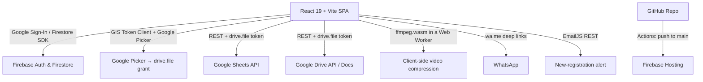

# Consultoria — Design Doc

This document describes the architecture, data models, and integration flows of
**Consultoria** — a mobile-first web app that bridges two gaps in a personal
training workflow:

1. **Enhanced Google Sheets experience** — a phone-friendly interface for
   students to view and fill their weekly training spreadsheet without fighting
   Google's mobile Sheets app.
2. **Structured video-feedback loop** — students upload session videos; trainers
   deliver per-exercise text feedback; both parties are notified via WhatsApp
   deep links.

> **Scope**: Consultoria does **not** author training programs. The trainer keeps
> creating cycles (exercises, sets, reps, loads) in their existing Google Sheet;
> Consultoria reads that sheet for display and writes student responses back to a
> dedicated `Respostas` tab. The trainer's own layout is never modified.

> **Living document.** This doc is the consolidated source of truth for the
> current architecture. It supersedes the earlier stratified drafts (the
> `v0.1-full` / `v0.2-trainer` / `v0.3` branch snapshots and the separate
> `video-feedback-plan.md`, now folded in here). The **deployed** Firestore rules
> live in [`firestore.rules`](../firestore.rules) and the setup steps in
> [`setup_guide.md`](./setup_guide.md); where anything here disagrees with those
> files or the code, the code wins — please update this doc.

---

## 🎯 Goals

- **Mobile-first UX** — every screen is designed at a 375px baseline.
- **Near-zero cost** — 1 trainer + 20–30 students, expected bill **$0.00–$0.05/mo**.
  No backend, no Cloud Functions: everything runs in the browser against Firebase
  and Google APIs.
- **Google Sheets as source of truth** — the trainer's spreadsheet defines every
  session; canonical student data is mirrored to Firestore.
- **WhatsApp-native notifications** — via `wa.me` deep links (no WhatsApp Business
  API, no bot number, no cost).
- **Language** — all user-facing text is **PT-BR**; the codebase (identifiers,
  comments, commits) is **English**.

---

## 🛠️ Tech Stack


```mermaid
graph TD
    Client[React 19 + Vite SPA] -->|Google Sign-In / Firestore SDK| Firebase[Firebase Auth & Firestore]
    Client -->|GIS Token Client + Google Picker| Picker[Google Picker → drive.file grant]
    Client -->|REST + drive.file token| SheetsAPI[Google Sheets API]
    Client -->|REST + drive.file token| DriveAPI[Google Drive API / Docs]
    Client -->|ffmpeg.wasm in a Web Worker| Compression[Client-side video compression]
    Client -->|wa.me deep links| WhatsApp[WhatsApp]
    Client -->|EmailJS REST| Email[New-registration alert]
    GitHub[GitHub Repo] -->|Actions: push to main| Hosting[Firebase Hosting]
```

### Frontend
- **React 19 + Vite** — SPA, fast HMR, optimised production bundles.
- **TypeScript** — strict mode throughout.
- **Tailwind CSS v4** — responsive utilities, class-based dark mode, glassmorphism UI.
- **React Router** — client-side routing.
- **Recharts** — progress graphs (load, RPE, volume over time).
- **Lucide React** — icon set.
- **ffmpeg.wasm** (`@ffmpeg/ffmpeg` + `@ffmpeg/util`) — client-side video
  compression in a Web Worker, lazy-loaded only when an upload starts.
- **canvas-confetti** — post-session celebration.

### Backend & auth (all client-side / serverless)
- **Firebase Auth** — Google Sign-In (the only provider).
- **Google Identity Services (GIS) Token Client** — silent OAuth access-token
  refresh (see §OAuth Token Strategy).
- **Google Picker** — lets the student select the training spreadsheet, granting
  per-file `drive.file` access without a broad Sheets scope.
- **Cloud Firestore** — user/trainer records, cycle/session state, exercise
  actuals, video metadata, feedback.
- **Firebase Hosting** — CDN static hosting (with COOP/COEP headers for
  SharedArrayBuffer, required by ffmpeg.wasm).
- **EmailJS** — browser-side transactional email for new-registration alerts.

### Integrations
- **Google Sheets API** — read training tabs; write student answers to `Respostas`.
- **Google Drive API** — create per-session video folders, upload compressed
  videos, and create the weekly feedback Google Doc.
- **WhatsApp** — `wa.me` deep links for start/finish/video/feedback notifications.

---

## 🔑 Auth & Identity Model

**One Google account, two capabilities.** Everyone signs in with Google (Firebase
`signInWithPopup`, `GoogleAuthProvider`). There is **no `role` field** and no
separate trainer login — a single account can act as a **student**, a **trainer**,
or both, and toggles between them with a persisted `mode` (`'student' |
'trainer'`, stored per-uid in `localStorage`).

- **Student identity** — the account holds a `users/{uid}` document. Google
  sign-in is required because the app acts on the student's own Sheet and Drive
  with their OAuth token.
- **Trainer eligibility** — the account's verified Google email matches a
  `trainers/{email}` document. A student registers a trainer by email; the
  invited person becomes a confirmed trainer the first time they sign in with
  Google using that same address (the verified email proves ownership, flipping
  `status` `pending → confirmed` — see `AuthContext`).
- **Mode resolution** — on sign-in the app resolves a default: a non-eligible
  account is always a student; an eligible account honours its remembered choice,
  otherwise defaults to *student* if it's an established student (profile + at
  least one cycle) and *trainer* otherwise.

### Registration approval (allowlist)

The app is publicly reachable, so **new student registrations require manual
approval**. Anyone can sign in, but a first-time user cannot create a `users`
profile until their email is added to the **`allowlist/{email}`** collection (done
from the Firebase console). Until then they see a "Conta aguardando aprovação"
screen ([`PendingApproval`](../src/pages/PendingApproval.tsx)).

- The pending screen records the request in **`access_requests/{uid}`** (email,
  name, photo, timestamp) so an admin can review the queue in the console without
  digging through Authentication → Users. The entry is a one-shot marker; it also
  suppresses duplicate alert emails, and is cleared once the user is approved and
  onboards.
- If EmailJS is configured (`VITE_EMAILJS_*`), the app also sends one alert email
  per new request via [`emailService`](../src/services/emailService.ts). Email is
  best-effort; the queue is the reliable record. The recipient address lives in
  the EmailJS template, never in the bundle.
- Existing students (who already hold a `users` doc) and invited trainers are
  unaffected — the gate applies only to brand-new registrations.

See [`setup_guide.md` → Approving new users](./setup_guide.md) for the console steps.

---

## 🔐 OAuth Token Strategy (zero-cost, client-side)

The app requests a **single non-sensitive scope: `https://www.googleapis.com/auth/drive.file`**.

- `drive.file` grants access only to files the app **creates** (video folders,
  the feedback Doc) **or that the user explicitly picks** via the Google Picker.
  It does **not** grant broad Drive/Sheets access, which keeps the app on
  non-sensitive scopes and avoids Google's sensitive-scope verification.
- **Reading/writing the training spreadsheet** is unlocked by the **Google
  Picker**: when the student picks their sheet (their own, or one a trainer shared
  with them — see the "Shared with me" view in
  [`pickerService`](../src/services/pickerService.ts)), that action grants
  `drive.file` access to that specific spreadsheet id. The grant persists per
  (user, file), so the student picks once and later sessions read/write it by id
  with no re-pick. The broad `spreadsheets` scope is **not** requested.

**Token acquisition & caching** (see [`AuthContext`](../src/contexts/AuthContext.tsx)):

- The `drive.file` scope is added to the **Firebase sign-in popup itself**
  (`provider.addScope(...)`), so the OAuth access token is captured from
  `GoogleAuthProvider.credentialFromResult` on the same user gesture — the first
  page load already has a valid, correctly-scoped token and never needs a second,
  browser-blockable GIS popup.
- The token (+ expiry) is cached in **`localStorage`** (`googleAccessToken`), so a
  return visit within the ~1h lifetime reuses a still-valid token instead of
  re-prompting. Cleared on sign-out.
- `getAccessToken()` waits for the async-loaded GIS script before its first call,
  and **coalesces concurrent callers** onto one in-flight request/popup. When a
  refresh is needed it uses the GIS Token Client with `prompt: ''` (silent unless
  Google actually needs a fresh consent).
- The GIS client is given the signed-in address as its **`hint`**. Without it,
  `prompt: ''` cannot auto-select an account when the browser holds more than one
  Google session, and Google falls back to the account chooser — turning every
  hourly renewal into a visible "pick your account" prompt.
- **Renewal is proactive, not on-demand.** The browser GIS flow has no refresh
  token, so a token *must* be re-obtained from Google roughly hourly. A timer in
  `AuthProvider` (plus a `visibilitychange` check, since backgrounded tabs freeze
  timers) renews ~10 min before expiry while the page is open and the Google
  session is warm — where the request is normally satisfied silently. Otherwise
  expiry is only ever discovered on a *cold* page load, with no user gesture
  available, which is exactly when a popup gets blocked.
- The in-memory token is **re-read from `localStorage`** before any renewal
  decision, so a second tab (or the home-screen app running alongside Safari)
  adopts a token the other one just refreshed instead of prompting again.
- `useGoogleTokenWarmup()` is the last-resort fallback for a token that went
  stale anyway: it re-authorizes on page open and, if that needs a gesture, on
  the student's first interaction. Mounted on every student page that touches
  Sheets/Drive — dashboard, cycle, **session and feedback** views.

---

## 📊 Firestore Data Models

The authoritative definitions live in [`src/types.ts`](../src/types.ts); the
summary below tracks it.

### `users/{uid}` — students
`{ uid, email, displayName, photoURL, whatsappPhone, notifyTrainer?, createdAt }`.
`whatsappPhone` is E.164 without `+` (e.g. `5511999999999`), used to build
`wa.me` links. There is **no `role`** field.

### `trainers/{email}` — global, keyed by lowercased email
`{ id (=email), email, name?, whatsappPhone, status: 'pending'|'confirmed',
createdByStudentUid, confirmedAt?, createdAt }`. Created (as `pending`) by the
first student to register that email; the email is the immutable doc id. Existence
is what makes a Google account "trainer-eligible".

### `student_trainers/{studentUid}_{trainerEmail}` — links
`{ id, studentUid, studentEmail, studentName, trainerEmail, trainerName?, createdAt }`.
A student may register any number of trainers; each link is one doc.

### `cycles/{cycleId}` — one per training spreadsheet
`{ id, studentUid, studentName?, studentWhatsapp?, googleSheetId, googleSheetUrl,
googleSheetTitle?, title, modality, modalityCustom?, status: 'active'|'archived',
startDate, archivedAt?, createdAt, trainerEmail?, trainerName? }`.

- `Modality` ∈ `Força | Mobilidade | Cardio | Competição | Outro` (`modalityCustom`
  holds the free-text value when `Outro`).
- `trainerEmail` is **optional** — a cycle can run with no trainer (no feedback
  loop). Student identity (`studentName`/`studentWhatsapp`) is **denormalised** so
  a trainer can render/notify without reading the student's `users` doc (which
  rules disallow).
- Archive is a soft-delete (data retained for history); restorable.

### `cycles/{cycleId}/weeks/{weekId}` — cycle weeks
`{ id, cycleId, weekNumber, startedAt, status?: 'in_progress'|'completed',
completedAt?, feedbackDocId?, feedbackDocUrl?, feedbackDocGeneratedAt? }`. One doc
per "Começar Semana X". A week not yet started simply has no doc.
`feedbackDocId/Url` point to the single weekly feedback Google Doc
("Feedbacks - Semana X") and `feedbackDocGeneratedAt` records when it was last
built (compared against `feedback.updatedAt` to detect a stale doc). Legacy docs
with no `status` are treated as `in_progress`.

### `sessions/{sessionId}` — one training-session instance
Key fields: `{ cycleId, studentUid, trainerEmail?, studentName?, studentWhatsapp?,
tabName, order?, weekNumber,
status: 'pending'|'in_progress'|'paused'|'completed'|'skipped',
date, startedAt?, finishedAt?, skippedAt?, pausedAt?, pausedMs?, preWorkout?,
postWorkout?, exerciseEntries?, completedSets?, driveFolderId?, driveFolderUrl?,
hasVideos, videosNotifiedAt?, feedbackStatus?: 'none'|'draft'|'complete',
plan? }`. (`weeklyFeedbackDocGenerated?` still exists on old docs but is no
longer read or written — see the weekly Doc section.)

- Pre-created as `pending` for each training tab when a week starts.
- `pausedAt` / `pausedMs` — the pause in flight, and the accumulated total of all
  closed pause intervals. Every duration reading subtracts `pausedMs`, so a
  session set aside overnight reports time trained, not wall-clock time. Sessions
  that were never paused carry neither field (read as 0).
- `exerciseEntries` — student per-**set** notes keyed by set key (`r{rowNumber}`
  or `{exerciseName}#{index}`), written back to sheet columns F/G on finish; `rpe`
  is omitted when left blank (never coerced to 0).
- `completedSets` — Firestore-only set-completion ticks driving the session
  timeline's connectors (not written back to the sheet).
- `plan?: ParsedSheetTab` — a snapshot of the parsed tab saved student-side so the
  trainer (who has no Google token for the sheet) can render the same plan on the
  feedback page.

### `session_exercises/{id}` — actuals cache (canonical for reports)
One doc per exercise **set** per session, `id = ${sessionId}_${exerciseSlug}_${setIndex}`.
Holds planned values (from the sheet) + student actuals + `isDone`,
`isPersonalRecord?`, and a denormalised `sessionDate` for time-series queries.

### `videos/{id}` — uploaded videos
`{ sessionId, cycleId, studentUid, trainerEmail?, exerciseName?,
freeFormDescription?, driveFileId, driveFileUrl, driveThumbnailUrl?,
originalSizeMB, compressedSizeMB, uploadedAt }`.

### `feedback/{sessionId}` — trainer feedback (text only)
`{ id (=sessionId), sessionId, cycleId, studentUid, studentName?, trainerEmail,
status: 'draft'|'complete', exerciseFeedback[], generalNotes, createdAt,
updatedAt?, completedAt?, feedbackDocUrl? }`. `updatedAt` is bumped on every
trainer write — it is what tells the weekly Doc apart as fresh or stale.
`exerciseFeedback[]` carries `textFeedback` and
a `mediaFiles[]` array **kept for backward compatibility only** — trainer media
upload was removed, so new feedback is text-only (any legacy media still renders
read-only).

### `cycles/{cycleId}/progressPhotoFolders/{id}` — progress photos
`{ id, driveFolderId, driveFolderUrl, date, createdAt }`.

---

## 👤 Trainer Registration & Connection

Because trainers read the student's Sheet through **Google sharing** (not through
the app), the flow is:

1. From **Meus treinadores** (`/student/trainers`) the student registers a trainer
   by **email + WhatsApp**. The first student to use an email creates the
   `pending` `trainers/{email}` record; later students just link to it via a
   `student_trainers` doc.
2. The student sends a **WhatsApp nudge** (`wa.me`) inviting the trainer to sign
   in. The trainer confirms simply by signing in with Google using that email
   (`pending → confirmed`).
3. The student **shares their Google Sheet (as Viewer) with each trainer's email**
   — reminded in the UI on *Meus treinadores* and on *Adicionar Programa*. The
   trainer can update their WhatsApp number from their dashboard; the email is
   immutable.

---

## 📋 Cycle Management

Adding a cycle ([`AddCycle`](../src/pages/student/AddCycle.tsx)):

1. Student taps **"Adicionar Programa"**.
2. Picks the trainer this program belongs to (their registered trainers, or "Sem
   treinador").
3. Selects the spreadsheet with the **Google Picker**
   ([`SheetPickerButton`](../src/components/student/SheetPickerButton.tsx) →
   [`useSheetPicker`](../src/hooks/useSheetPicker.ts)) — from *Meu Drive* or
   *Compartilhados comigo*. Picking grants `drive.file` on that sheet and returns
   its id/name/url; **no URL pasting**.
4. Student fills **Título** (pre-filled from the sheet name, editable) +
   **Modalidade** (with free-text "Outro").
5. A `cycles` doc is created; the sheet's training tabs become sessions when the
   student starts a week.

**Archive / restore** — the ⋯ menu archives a cycle (hidden from the main view,
retained for history); a "Ver arquivados" toggle reveals archived cycles for
restore. There is no hard delete.

---

## 🗓️ Week Lifecycle & Session Flow

A cycle progresses week by week via the `weeks` sub-collection. A week is
**Não iniciada** (no doc) → **Em andamento** (`in_progress`) → **Concluída**
(`completed`).

- **"Começar Semana N"** creates the week and **re-reads the spreadsheet**,
  pre-creating one `pending` session per training tab. Shown only for the first
  week, or once the current week is concluded (the next week's plan isn't known
  until the trainer updates the sheet).
- **"Concluir Semana N"** appears only once **every** session is `completed` or
  `skipped`; it marks the week `completed`, after which its sessions are read-only
  (open-only; no start/skip/unskip, no uploads). Concluded weeks render below the
  current one as read-only accordions.
- **Deferred start.** Opening a session ("Abrir") does **not** start it. It becomes
  `in_progress` — and the trainer's WhatsApp "started" message fires — only when
  the student fills the two pre-workout questions and taps "Começar treino". A
  started session stays the *current* workout — banner included — until it's
  paused, concluded or skipped, with no time limit; the header's duration reports
  the elapsed span minus paused time, days included (`3d 02:05`), so a forgotten
  session stays visible instead of being silently dropped. Several sessions *can*
  be in progress at once (parallel programs, or one left unconcluded); the
  "Treino em andamento" bar always shows exactly one — the most recently started.
- **Pause.** "Pausar treino" (beside "Finalizar treino") is for a workout that
  won't be finished the same day. It stops the clock (`pausedAt`), stands the
  session down from the "Treino em andamento" bar, drops its offline snapshot,
  and makes the plan read-only behind a "Retomar treino" call-to-action.
  Resuming folds the interval into `pausedMs` and restarts the clock. Pause is
  **not** terminal — the week stays "em andamento" until the session is concluded
  or skipped, so a paused workout can never be forgotten into a finished week.
- **Statuses** `pending | in_progress | paused | completed | skipped`. Skipped
  sessions are revertible ("Despular"); opening one is read-only until
  un-skipped, and one skipped *while paused* returns to `paused`, not to
  `in_progress` — its open pause interval still has to be closed by a resume.
- The session list is a table (`name · status · Abrir`); completed rows show
  "Concluído em dd/mm". A paused row reads **Pausado** and its open action turns
  orange ("Retomar") — the same orange as partial feedback, marking a row that's
  waiting on the student.

---

## 🏋️ Training Session View

### Spreadsheet structure (per training tab)

```
Row 1   Metadata: block/session ID in C, "Visto do Aluno" label in G
Row 2   Config:   motto in A, training-day label in C, viewed checkbox in G
Rows 3–4  Empty
Row 5   ── "Preencha abaixo (INÍCIO DO TREINO)" section header ──
Row 6   "Qual o seu nível de ânimo?"  |  integer 1–5 (stars) in col B
Row 7   "Como está se sentindo?"      |  dropdown string in col B
Row 8   Section label: "Aquecimento" (or other warm-up label)
Row 9   Column headers: Exercício · Séries · Repetições · Carga · Descanso · Observações · RPE
Rows 10+ Warm-up exercise rows
Row N   Section label: "Treino" (main workout)
Rows N+ Main exercise rows (multi-set exercises span multiple rows)
Row M   "rm"  ← student records 1RM / personal best
Row M+1 ── "Preencha abaixo (FINAL DO TREINO)" section header ──
Row M+2 "Qual o seu nível de ânimo?"  |  integer 1–5 in col B
Row M+3 "Como está se sentindo?"      |  dropdown string in col B
```

**Column positions (A–G):**

| Col | Label | Notes |
|-----|-------|-------|
| A | Exercício | Exercise name; **empty on continuation rows** of a multi-set exercise. May carry a YouTube link (→ `PlannedExercise.videoUrl`). |
| B | Séries | Sets; also holds the energy-level answers (rows 6, M+2) |
| C | Repetições | Reps (number or string, e.g. "30 segundos") |
| D | Carga | Load in kg; special tokens `"ESCOLHER"` (student picks) / `"--"` |
| E | Descanso | Rest period |
| F | Observações | Notes (trainer's, and student writes theirs back here) |
| G | RPE | Target RPE 1–10; `"PREENCHER"` = student must fill; also the write-back target |

The first tab (**"Dados"** / "Strikes") is compliance/summary data and is always
skipped by the parser.

### Reading & parsing

On open the app calls
`GET /v4/spreadsheets/{sheetId}/values/{tabName}!A:R` and parses the 2D array:

1. **Skip rows 1–2** (metadata/config); write `TRUE` to `G2` ("Visto do Aluno").
2. **Pre-workout block** — first row whose col A contains `"INÍCIO DO TREINO"`
   (case-insensitive); the next two rows are energy (B = 1–5) and feeling (B = string).
3. **Section labels** (generic — any name) — a row where col A is non-empty and
   B–G are all empty and it isn't an exercise-header or pre/post marker. Examples:
   "Aquecimento", "Treino", "Extra", "Cardio", "Mobility".
4. **Exercise-header rows** — col A contains `"Exercício"`; skipped (visual only).
5. **Exercise rows** — col A non-empty starts a new exercise; col A empty is a
   continuation set of the previous one. Load token `"ESCOLHER"` → "Escolha o
   peso"; RPE token `"PREENCHER"` → required input.
6. **"rm" row** — col A exactly `"rm"` → "Recorde pessoal" input card.
7. **Post-workout block** — first row whose col A contains `"FINAL DO TREINO"`.

The parsed result is the `ParsedSheetTab` shape (exercises with set-groups,
pre/post blocks with the marker row indices used for write-back).

### UI

- **Pre-workout form** — 5-star energy selector + feeling buttons (Bem / Mal).
  Saved to `sessions.preWorkout`. Filling it is what starts the session.
- **Exercise cards** — planned values read-only; per set the student fills
  reps/load/RPE (color-coded 1–10 picker), observations, and a "Concluído" tick. A
  **"💬 Feedback anterior"** chip appears when prior trainer feedback exists for
  that exercise name.
- **"rm" card** — best lift for the session (→ `session_exercises` with
  `isPersonalRecord: true`).
- **Post-workout form** — same questions (feeling: Igual / Melhor / Pior).
- **"Finalizar Treino"** — writes actuals back to the sheet + `Respostas`, saves
  `session_exercises`, sets `status: 'completed'`, and fires the trainer notification.
- **"Pausar treino"** — secondary action beside it: `status: 'paused'` +
  `pausedAt`, nothing written to the sheet and no trainer notification (the
  "iniciado" message already went out; a pause is not news). "Retomar treino"
  reverses it, adding the interval to `pausedMs`.

---

## 📝 Spreadsheet Write-back (`Respostas` tab)

Student answers are appended to a **`Respostas`** tab created on the first
completion if absent; the trainer's own tabs are never touched. One header row,
one data row per exercise set per session (PT-BR headers):

`Data · Treino · Exercício · Série · Reps Previstas · Carga Prevista · RPE Previsto ·
Reps Realizadas · Carga Realizada · RPE Realizado · Observações · Concluído ·
Ânimo Início · Sentimento Início · Ânimo Final · Sentimento Final`

Pre/post data is repeated per row (denormalised) so each row is self-contained for
filtering/pivoting.

> **Canonical data lives in Firestore.** `Respostas` is a convenience export for
> the trainer; reports are always generated from Firestore. Per-set observations
> and RPE are also written back inline to the sheet's F/G columns on the exact
> rows they came from.

---

## 📹 Video Upload Flow (student)

```
Records workout video on phone
   ↓  App compresses client-side (ffmpeg.wasm, ~100–180 MB → ~10–15 MB)
   ↓  Uploads to the student's Google Drive (per-session folder)
   ↓  Student taps "Notificar treinador" → wa.me deep link
   ↓  Trainer opens the session → watches → writes text feedback
```

### Trigger & compression
"Adicionar vídeo" opens a native `<input type="file" accept="video/*"
capture="environment">`. The selected `File` is compressed in a **Web Worker**
([`compress.worker.ts`](../src/workers/compress.worker.ts), driven by
[`useVideoCompress`](../src/hooks/useVideoCompress.ts)) — lazy-loaded on first use;
the ffmpeg core WASM (~10 MB) is fetched from CDN and browser-cached thereafter.

Encode target: `scale=-2:720` (720p, preserve AR), H.264 `crf 28 preset fast`,
AAC 128 k, `+faststart` (streams before full download). A 60s phone clip →
≈ 10–15 MB. The original is never uploaded; a progress bar is shown.

> **Hosting requirement**: multi-threaded WASM needs `SharedArrayBuffer`, which
> needs cross-origin isolation. `firebase.json` sets
> `Cross-Origin-Opener-Policy: same-origin` and `Cross-Origin-Embedder-Policy:
> require-corp` on all responses.

### Drive folder + upload
On the first video for a session the app creates the session's folder inside a
**4-level find-or-create hierarchy** (folders reused, never duplicated) in the
**student's own Drive**, sets it "Anyone with the link → Viewer", and stores its
id/url on the session. Each compressed video is uploaded (multipart), set
"Anyone with link → Viewer", recorded in a `videos` doc, and flips
`sessions.hasVideos = true`. The student tags each video with an exercise (or a
free-form description for general footage).

### Notification
After uploading, **"Notificar treinador"** opens a branded `wa.me` deep link
(see §WhatsApp) to the cycle's trainer with a link back to the session.

### First-use consent
The first upload may surface Google's `drive.file` consent (even with
`prompt: ''`). The UI handles rejection gracefully ("Autorize o acesso ao Google
Drive…"); subsequent calls refresh silently.

---

## 📂 Google Drive Folder Structure

```
[Student's My Drive]
└── Consultoria: <Trainer> - <Student>/      ← root, one per trainer↔student pair
    └── <Cycle title>/                       ← one per cycle
        └── Semana N/                        ← one per cycle week
            └── Treino A — 2026-05-21/       ← one per session
                ├── Treino A - agachamento_…​.mp4   ← videos, prefixed
                └── Treino A - extensora_…​.mp4        with the session name
```

All videos live in the **student's** Drive under `drive.file`; cross-party access
is via "anyone with link → Viewer". Trainers do **not** upload media, so there is
no trainer-side feedback folder.

---

## 💬 Trainer Feedback Flow (text only)

### Dashboard
The trainer dashboard (`/trainer`) shows an **"Aguardando feedback"** queue
(completed sessions with videos and no complete feedback — driven by the
denormalised `sessions.feedbackStatus` to avoid N+1 reads) plus all completed
feedbacks grouped by student. It also lets the trainer edit their WhatsApp. There
is no approve/reject student flow.

### Feedback view (`/trainer/sessions/:sessionId`,
[`TrainerFeedbackView`](../src/pages/trainer/TrainerFeedbackView.tsx))
Per session the trainer sees the session header (student, tab, date, pre/post
answers), the **"Plano de treino"** rendered from the student-saved `plan`
snapshot, per-exercise video players (streamed directly from Drive shareable
URLs), a **text feedback** field per exercise, and a **Notas gerais** field. Media
attachment was removed — feedback is text only (legacy media renders read-only).

- **"Salvar rascunho"** → `feedback.status = 'draft'`, `sessions.feedbackStatus = 'draft'`.
- **"Feedback Completo"** → `status = 'complete'`, `completedAt = now()`,
  `sessions.feedbackStatus = 'complete'`, and a branded `wa.me` link to the student.
- Both writes stamp `feedback.updatedAt = now()`.

### Weekly feedback Google Doc
Feedback is also consolidated into a single **weekly Google Doc** per cycle week
("Feedbacks - Semana X"), built from HTML by
[`docsService`](../src/services/docsService.ts)
(`buildWeeklyFeedbackHtml` → `upsertWeeklyDoc`), its content rebuilt from scratch
on every update. The Doc id/url/build time are stored on the `weeks` doc
(`feedbackDocId/Url/GeneratedAt`).

**One file per week, for the week's whole life.** A rebuild overwrites the
existing file's content (`files.update` with `uploadType=media`) instead of
creating a replacement and deleting the predecessor. That keeps the Doc's URL
stable for anyone who bookmarked it, and cuts a rebuild from five Drive calls
(three chained folder lookups + create + delete) to one. A new file is created
only when the week has no Doc yet, or when the one it points at is gone — a
404/410, a revoked per-file grant, or a Doc sitting in the bin, which is
deliberately left there rather than resurrected (`driveFileExists` already counts
trashed as gone).

Drive's HTML→Doc conversion always produces a *paged* doc, so a Docs API
`updateDocumentStyle` (`documentFormat.documentMode = PAGELESS`) switches it to
**pageless** — the doc is read on phones, where page breaks only get in the way.
That call takes the same non-sensitive `drive.file` scope (the app created the
file). It is **fired without being awaited**: it is the slowest step in a rebuild
(the Docs backend loads the document model of a freshly converted file) and
nothing downstream needs it, so blocking "Atualizar" on it just made rebuilds
feel slow. `keepalive` lets it finish after a navigation, and failure is
tolerated — the reader simply gets a paged doc.

Two rules keep the stored link honest:

- **Freshness is derived, not flagged.** The student's action reads "Abrir" only
  when `weeks.feedbackDocGeneratedAt` is at or after this session's
  `feedback.updatedAt`; otherwise it reads "Atualizar". So a session that gets a
  second round of feedback (the trainer answering exercises left out of a partial
  reply) can always be rolled into the Doc. The old
  `sessions.weeklyFeedbackDocGenerated` boolean did the opposite — it spent the
  action on first use and left later feedback stranded.
- **Create → repoint → delete.** The new Doc is created first, the `weeks` doc is
  moved onto it, and only then is the previous Doc deleted from Drive. Deleting
  up-front left `feedbackDocUrl` pointing at a dead file whenever the rebuild that
  followed failed. As a backstop, the student view checks the stored Doc still
  exists in Drive (`driveFileExists`, skipped when no Google token is live) and
  falls back to "Atualizar" when it doesn't.

### Student feedback view (`/student/sessions/:sessionId/feedback`,
[`FeedbackView`](../src/pages/student/FeedbackView.tsx))
A read-only mirror: per-exercise text, general notes, and a link to the weekly
Doc. Reachable from the WhatsApp deep link or the session in the cycle view.

---

## 🔁 Historical Feedback

When a session's exercise list renders, the app queries `session_exercises` by
`studentUid` + exact `exerciseName`, most-recent 5, and checks `feedback` for
exercise-level notes on those sessions. If found, a **"💬 Feedback anterior"** chip
opens a bottom sheet (most recent first, up to 5).

---

## 📊 Reports & Progress Charts

Recharts, sourced from `session_exercises`:

| Chart | X | Y | Filter |
|---|---|---|---|
| Load progression | Session date | Actual load (heaviest set) | Per exercise |
| RPE over time | Session date | Avg actual RPE | Per exercise |
| Volume | Session date | Σ(actual reps × load) | Per exercise |
| Energy level | Session date | Pre-workout energy | All sessions |
| Completion rate | Week | % exercises done | All sessions |

---

## 📱 WhatsApp Deep-Link Spec

All notifications are `wa.me` deep links opened in a new tab; on mobile they open
WhatsApp with the message pre-filled and the user taps Send once. Every message is
built by [`notifyService`](../src/services/notifyService.ts) with a branded layout
(WhatsApp markup `*bold*` / `_italic_`):

```
*[Consultoria]*
{subject}

{body}

_-- Consultoria ({appOrigin})_
```

| Trigger | Sender → Recipient | Subject / body |
|---|---|---|
| "Começar treino" (pre-workout submitted) | Student → Trainer | started training `*{tabName}*` (Semana {n}) |
| "Concluir treino" (finished) | Student → Trainer | finished `*{tabName}*` on {date} |
| "Notificar treinador" (after upload) | Student → Trainer | sent {n} video(s) + link back to the session |
| "Feedback Completo" | Trainer → Student | feedback for `*{tabName}*` ({date}) is ready + link |
| Trainer invite / confirm nudge | Student → Trainer | link to sign in and confirm |

> **No emoji in `wa.me` bodies.** Some recipient devices render even universal
> emoji as `�`; message strings stay plain-text. In-app emoji (rendered by the
> browser) are unaffected.

---

## 📊 Google Sheets Template (PT-BR, AA contrast)

A companion Apps Script, [`criar-modelo-treino.gs`](./criar-modelo-treino.gs),
generates a ready-to-use training-sheet template in the trainer's Drive. Paste it
into script.google.com and run `criarModeloDeTreino`. The template preserves the
row/section structure the parser expects and uses a WCAG 2.1 AA-verified palette.

**Contrast fixes baked into the template:**

| Element | Was | Now | Fixed ratio |
|---------|-----|-----|-------------|
| "INÍCIO/FINAL DO TREINO" header | `#DC2626` / white (3.46:1 ❌) | `#991B1B` / white | 5.83:1 ✅ |
| RPE chips (numbered) | `#22C55E` / white (2.14:1 ❌) | `#15803D` / white | 4.54:1 ✅ |

**Full palette:** section headers `#1E293B`/white (16:1); pre/post question rows
`#1C1917`/white (16.8:1); column headers `#334155`/white (10:1); planned cells
`#F8FAFC`/`#475569` (4.63:1); "PREENCHER" RPE `#FFF7ED`/`#9A3412` (5.0:1); "rm" row
`#FEF9C3`/`#854D0E` (5.5:1); Concluído `#DCFCE7`/`#166534` (5.4:1); metadata row
`#0F172A`/`#F97316` (6.8:1). All ≥ AA.

---

## 📸 Progress Photos

1. On a cycle's detail page the student taps **"Adicionar Fotos de Progresso"**.
2. The app creates a dated subfolder under `Consultoria — Fotos de Evolução/` in
   the student's Drive ("Anyone with the link → Viewer") and shows an **"Abrir
   pasta no Google Drive"** button — the student uploads photos in the Drive app
   directly (no re-implemented uploader).
3. The **Fotos de Evolução** page lists dated subfolders via the Drive API, fetches
   thumbnails, and renders a chronological timeline with a **side-by-side
   comparison** of any two photos.
4. Folder metadata is stored in the `progressPhotoFolders` sub-collection.

---

## 🔒 Secrets & Environment

| Var | Where | Used by |
|---|---|---|
| `VITE_FIREBASE_*` (6 keys) | `.env.local` / GitHub Secrets | Firebase SDK (client) |
| `VITE_GOOGLE_CLIENT_ID` | `.env.local` / GitHub Secrets | GIS Token Client (browser) |
| `VITE_GOOGLE_API_KEY` | `.env.local` / GitHub Secrets | Google Picker (`setDeveloperKey`) |
| `VITE_EMAILJS_SERVICE_ID` / `_TEMPLATE_ID` / `_PUBLIC_KEY` | `.env.local` / GitHub Secrets (optional) | New-registration alert emails |
| `FIREBASE_SERVICE_ACCOUNT_KEY` | GitHub Secrets | CI deploy (Hosting + rules) |

All `VITE_*` values are public-safe (they ship in the client bundle). See
[`setup_guide.md`](./setup_guide.md) for how to obtain each.

---

## 🚀 Build & Deploy

Push to `main` triggers a GitHub Actions build + Firebase Hosting deploy (and a
Firestore rules deploy via `FIREBASE_SERVICE_ACCOUNT_KEY`). Hosting sets explicit
cache headers so new deploys take effect immediately, plus the COOP/COEP headers
ffmpeg.wasm needs. See [`setup_guide.md`](./setup_guide.md) and
[`.github/workflows`](../.github/workflows).

---

## 🛡️ Firestore Security Rules

The **authoritative, deployed** rules are [`firestore.rules`](../firestore.rules).
Model summary:

- **`isOwner(uid)`** — `request.auth.uid == uid`; scopes every student-owned doc.
- **`isTrainerFor(email)`** — the caller's **verified `request.auth.token.email`**
  equals the doc's denormalised `trainerEmail`; grants trainer read (and the
  narrow writes they need, e.g. `sessions.feedbackStatus`, and authoring
  `feedback` stamped with their own email).
- **`isApproved()`** — an `allowlist/{email}` doc exists for the caller; required
  to **create** a `users` profile (the registration gate). Existing students are
  unaffected.
- **`isTrainerAdmin()`** — any confirmed trainer; may read/clear the
  `access_requests` review queue.
- `allowlist` is read-only from the app (own entry only); all writes happen in the
  console. `access_requests` is a one-shot marker created by the requester.

There is no `workspaces`/`student_workspaces` model and no `role` — those belonged
to earlier drafts and have been removed.

---

## 🔍 Verification Plan

### Manual E2E
1. **Registration gate** — new account signs in → "aguardando aprovação" +
   `access_requests` entry (+ alert email if configured); add email to `allowlist`
   → reload → onboarding.
2. **Trainer registration** — student registers a trainer by email+WhatsApp → nudge
   → trainer signs in with Google (same email) → `pending → confirmed`.
3. **Cycle add** — pick a sheet via the Picker (My Drive and Shared-with-me both
   work) → "Dados" filtered out → cycle created.
4. **Week + session** — "Começar Semana 1" pre-creates a `pending` session per tab
   → open one → pre-workout starts it (trainer WhatsApp fires) → fill actuals incl.
   a "PREENCHER" RPE and an "ESCOLHER" load → "rm" → post-workout → "Finalizar" →
   `Respostas` row + F/G write-back + `session_exercises` in Firestore →
   "Concluir Semana" locks the week read-only.
5. **Multi-set grouping** — a 6-continuation-row exercise renders as one card, 6 sets.
6. **Video** — upload 2 videos (1 tagged, 1 free-form) → compression → files in the
   4-level Drive folder → "Notificar treinador" opens branded WhatsApp.
7. **Progress photos** — dated folder created → Drive link opens → timeline +
   side-by-side render.
8. **Feedback** — trainer opens the awaiting session → sees plan + videos → per-
   exercise text + general notes → "Feedback Completo" → student WhatsApp + weekly
   Doc updated → student sees read-only feedback.
9. **Historical feedback** — a later session with the same exercise shows the "💬
   Feedback anterior" chip.
10. **Reports** — after 3+ sessions, load/RPE/volume/energy charts render.
11. **Token refresh** — leave the app 55+ min → trigger a Sheets write → silent
    re-auth with no popup.

### Automated
- **Firestore rules** (emulator) — cross-account isolation, unapproved user can't
  create a profile, trainer-only feedback writes (own email), student can't write
  another student's docs.
- **Sheets parser** unit tests — generic section detection, multi-set grouping,
  "PREENCHER"/"ESCOLHER"/"rm" token handling, pre/post block extraction.
